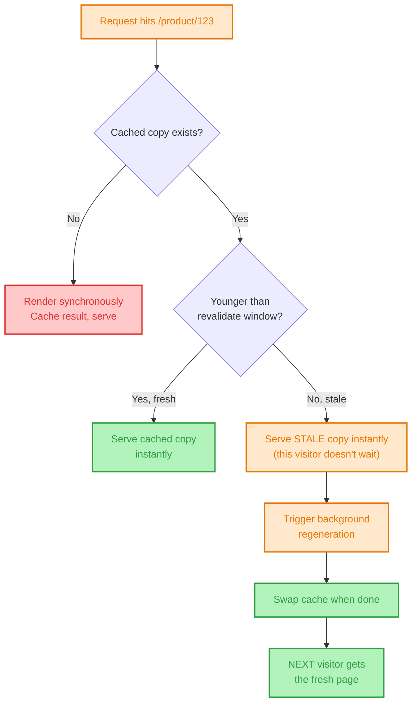
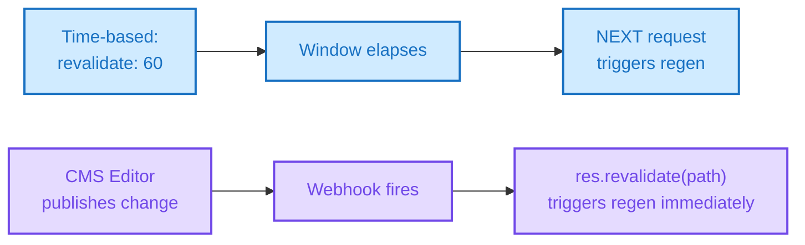
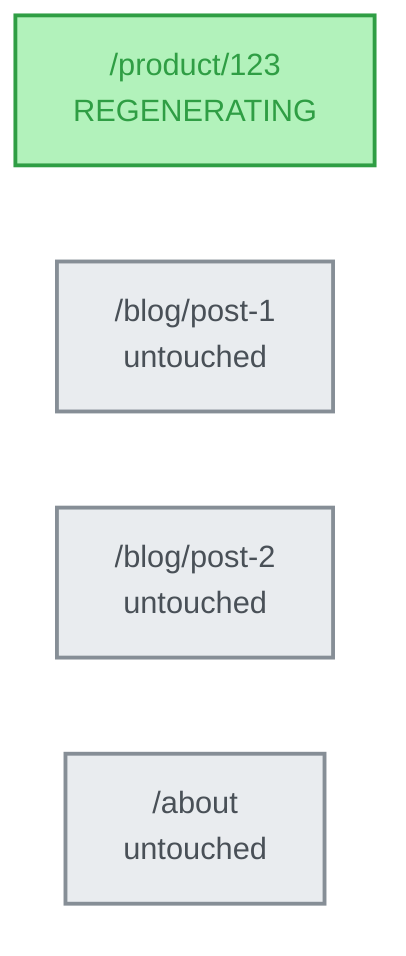

# 📖 The Definitive Guide to Incremental Static Regeneration (ISR)

> **The only architecture document you will ever need.**
> A masterclass on Incremental Static Regeneration: from the stale-while-revalidate contract and time-based vs on-demand triggers to the stampede problem, per-page cache internals, and where ISR breaks down at the edges. Written by Frontend Dev, for Frontend Dev.

[](https://example.com)
[](https://example.com)
[](https://example.com)

---

## 🧠 TL;DR (The 10-Second Mental Model)

If you forget everything else, remember this:

```text
SSG  = Build once, serve that file FOREVER (The Frozen Book)
SSR  = Render on EVERY request (The Custom Print Job)
ISR  = Build once, serve that file, then quietly REPRINT specific pages
       in the background when they're due (The Book With a Rewrite Clause)
```

**🚨 The #1 Interview Trap:**
**ISR is not "SSG with a timer that reruns the full build."** A full rebuild regenerates every page. ISR regenerates **one page at a time**, in isolation, triggered either by a per-page timer or an explicit webhook — the other 499,999 pages in your catalog are untouched. Confusing the two is the single most common ISR mistake in interviews.

**🚨 The #2 Interview Trap:**
**The visitor who triggers a time-based revalidation never sees the new content.** With `stale-while-revalidate`, the request that crosses the staleness threshold gets served the *old* cached page instantly, while regeneration happens in the background. Only the *next* request after regeneration completes sees the fresh page. If someone says "revalidate: 60 means it updates every 60 seconds," correct the mental model — it means "eligible to regenerate on the next visit after 60 seconds," not "auto-updates on a clock."

---

## 📑 Table of Contents

- [1. The Core Mental Model: The Rewrite Clause](#1-the-core-mental-model-the-rewrite-clause)
- [2. Why ISR Exists: The Two Failure Modes It Splits the Difference Between](#2-why-isr-exists-the-two-failure-modes-it-splits-the-difference-between)
- [3. The Absolute ISR Request Lifecycle](#3-the-absolute-isr-request-lifecycle)
- [4. Time-Based Revalidation](#4-time-based-revalidation)
- [5. On-Demand Revalidation](#5-on-demand-revalidation)
- [6. The Cache Internals: What's Actually Being Compared](#6-the-cache-internals-whats-actually-being-compared)
- [7. Every Problem ISR Introduces (and the Fix)](#7-every-problem-isr-introduces-and-the-fix)
- [8. `fallback: 'blocking'` / `dynamicParams`: ISR for Never-Built Pages](#8-fallback-blocking--dynamicparams-isr-for-never-built-pages)
- [9. ISR vs SSG vs SSR vs Client-Side Polling: The Ultimate Matrix](#9-isr-vs-ssg-vs-ssr-vs-client-side-polling-the-ultimate-matrix)
- [10. Visual Architecture Map](#10-visual-architecture-map)
- [11. System Architecture Diagram](#11-system-architecture-diagram)
- [12. Interview Kill Shots](#12-interview-kill-shots)
- [13. Deep-Dive Reference Index](#13-deep-dive-reference-index)

---

## 1. The Core Mental Model: The Rewrite Clause

Pure SSG makes one promise: this file is correct as of the last build, forever, until you rebuild. Pure SSR makes the opposite promise: this file is correct *right now*, at the cost of rendering it fresh on every single request.

ISR is a contract that sits between them, scoped **per page, not per site**:

```text
1. Page is built once (at build time, or on first request — see Section 8)
2. That static file is served to every visitor, instantly, from cache — just like SSG
3. When that specific page becomes "due" for a refresh (time elapsed, or an explicit
   trigger), the NEXT request to hit it gets served the stale cached copy immediately,
   while a fresh render happens in the background
4. Once that background render finishes, the cache is swapped — every visitor
   AFTER that point gets the new version
```

**The Architect's Truth:** ISR doesn't make pages "dynamic." It makes the *cache invalidation* granular and automatic. The render mechanism underneath is still `renderToString`-style static generation — ISR's actual innovation is deciding **when** to re-run it and **which page** to re-run it for, without a human triggering a full rebuild.

---

## 2. Why ISR Exists: The Two Failure Modes It Splits the Difference Between

**Failure mode A — pure SSG at scale:** a catalog with 500,000 product pages. One price changes. Your only lever is "rebuild everything" (slow, wasteful — see the SSG doc's Section 7) or "rebuild nothing until the next scheduled build" (stale for hours). Neither is acceptable for content that changes unpredictably but not every page at once.

**Failure mode B — pure SSR at scale:** the same catalog, but every page render-on-request. Traffic spikes (a product goes viral, a sale starts) now translate directly into origin server load — every visitor is a fresh render, so your infrastructure cost scales linearly with traffic, and a spike can genuinely take the origin down.

**ISR's answer:** render each page once, cache it like SSG (serving traffic spikes from the CDN edge with zero origin load), but let *that specific page* silently re-render in the background when it's actually stale — so you get SSG's request-time cost profile with SSR-like freshness, scoped to only the pages that actually need it.

---

## 3. The Absolute ISR Request Lifecycle

What happens when a request hits `/product/123` under ISR with `revalidate: 60`?

```text
[ Request arrives ] → CDN Edge Node
        │
        ▼
   Is there a cached copy?
        │
   ┌────┴─────────────────────┐
  YES                          NO (first-ever request, or evicted)
   │                            │
   Is it younger than 60s?      Render synchronously (like SSR, once)
   │                            → Cache the result → Serve
   ┌───┴───┐
  YES      NO (stale)
   │        │
Serve       Serve the STALE copy immediately (fast!)
cached      → Trigger a background regeneration
copy        → When done, swap the cache
   │        → This visitor never waited; the NEXT visitor gets fresh content
   ▼
Browser paints instantly either way
```

> **Architect's Note:** notice that in the "stale" branch, the *current* visitor is never blocked and never sees a loading state — they get the old page instantly. This is the single most misunderstood part of ISR: staleness triggers a background job, not a foreground wait.

---

## 4. Time-Based Revalidation

```javascript
// Next.js App Router
export const revalidate = 60; // seconds

export default async function ProductPage({ params }) {
  const product = await getProduct(params.id);
  return <Product data={product} />;
}
```

`revalidate: 60` doesn't mean "regenerate every 60 seconds" on a clock — there's no background cron ticking per page. It means: **once 60 seconds have passed since this page was last generated, the next incoming request becomes the trigger** for a background regeneration. A page with zero traffic in that window simply stays stale, cached, untouched — no wasted work happens for pages nobody is visiting. That's a deliberate efficiency property, not a limitation.

**Choosing a revalidation window:**

| Content type | Typical window | Why |
| :--- | :--- | :--- |
| Breaking news | Not ISR — use on-demand (Section 5) | Any polling delay is unacceptable |
| Product prices/inventory | 30–120s, or on-demand | Balance staleness risk vs. regeneration load |
| Blog posts | 1 hour – 1 day | Edits are infrequent and low-stakes if briefly stale |
| Marketing/about pages | Hours to days | Changes rarely, staleness is harmless |

---

## 5. On-Demand Revalidation

Time-based revalidation is a guess. On-demand revalidation is a fact — it's triggered by the actual event that made the page stale, typically a CMS publish webhook:

```javascript
// pages/api/revalidate.js — called by a CMS webhook the instant an editor publishes
export default async function handler(req, res) {
  if (req.headers['x-webhook-secret'] !== process.env.REVALIDATE_SECRET) {
    return res.status(401).end();
  }
  try {
    await res.revalidate(`/blog/${req.body.slug}`);
    return res.json({ revalidated: true });
  } catch (err) {
    return res.status(500).send('Error revalidating');
  }
}
```

**Why this matters architecturally:** unlike time-based revalidation, this triggers regeneration *immediately* on publish, regardless of traffic — the next visitor gets fresh content within seconds of the edit, even if that visitor arrives before any "60 second window" would have elapsed naturally. It also means zero wasted regeneration for pages that never change, since nothing fires unless the actual source content changes.

**Security note, easy to miss in an interview:** a revalidation endpoint is a public URL that triggers server-side compute. Always verify a shared secret or signed webhook payload — an unauthenticated revalidate endpoint is a trivial DoS vector (repeatedly hitting it forces continuous regeneration).

---

## 6. The Cache Internals: What's Actually Being Compared

ISR's cache is keyed **per path**, not per site — this is what makes "regenerate one page without touching the rest" possible at all.

```text
Cache store (conceptually a key-value map):
  /blog/post-1   → { html, json, generatedAt: T0, revalidate: 3600 }
  /blog/post-2   → { html, json, generatedAt: T1, revalidate: 3600 }
  /product/123   → { html, json, generatedAt: T2, revalidate: 60 }
```

Each entry independently tracks its own generation timestamp and its own revalidation window. Regenerating `/product/123` never touches, reads, or invalidates `/blog/post-1`'s entry. This is the concrete mechanism behind the "granular, not full-rebuild" claim in the TL;DR — worth stating explicitly if asked "how does it actually avoid rebuilding everything."

**Where the cache physically lives** matters for distributed deployments: a single-server setup can keep it in memory or on disk, but a multi-region CDN deployment needs the cache invalidation to propagate across every edge node — otherwise one region serves stale content while another has already regenerated. This is typically handled by the hosting platform (Vercel's Data Cache, Netlify's ISR support) rather than something you build yourself, but it's worth knowing it's not a trivial problem.

---

## 7. Every Problem ISR Introduces (and the Fix)

### 7.1 The thundering herd / regeneration stampede
If a page gets massive simultaneous traffic exactly when it goes stale, naively you could trigger *many* concurrent background regenerations for the same page — wasted compute, and a race on which result wins the cache write.

**Fix:** production ISR implementations (Next.js included) de-duplicate concurrent regeneration requests for the same path — only one regeneration actually runs; other simultaneous requests during that window are served the stale copy and don't trigger their own duplicate render.

### 7.2 Stale reads across a distributed cache
In multi-region deployments, a regeneration completing in one region doesn't instantly update every other edge node's cache.

**Fix:** rely on the hosting platform's cache propagation guarantees (most modern platforms handle this), and treat "eventually consistent within seconds" as the realistic guarantee — not "instantly consistent everywhere."

### 7.3 Revalidation storms from bulk content updates
A CMS bulk-import or migration touches 10,000 articles at once, firing 10,000 on-demand revalidation webhook calls near-simultaneously.

**Fix:** batch/debounce webhook triggers where possible, or fall back to a scoped rebuild for genuinely bulk changes rather than 10,000 individual on-demand calls.

### 7.4 Silent failures in background regeneration
If the background regeneration fails (data source down, API error), the visitor never sees an error — they got the stale page, which is by design. But if this isn't monitored, a broken data source can leave a page permanently stale without anyone noticing, since nothing crashes or alerts by default.

**Fix:** log and alert on regeneration failures explicitly; don't assume "no user-facing error" means "working correctly."

### 7.5 Confusing ISR freshness with real-time freshness
Treating a `revalidate: 60` page as if it were live data (e.g., a live sports score or stock ticker).

**Fix:** ISR is not a substitute for real-time data delivery. For genuinely live data, either use client-side fetching/polling/WebSockets layered on top of the static shell, or move that specific data to SSR/edge middleware.

---

## 8. `fallback: 'blocking'` / `dynamicParams`: ISR for Never-Built Pages

Everything above assumes the page was built at least once. What about a route that was never pre-built at all — a new product added after the last build, with no static file yet?

```javascript
// Pages Router
export async function getStaticPaths() {
  return { paths: knownSlugsAtBuildTime, fallback: 'blocking' };
}
```

```javascript
// App Router equivalent
export const dynamicParams = true; // allow rendering paths not returned by generateStaticParams
```

On the *first* request to an unbuilt path, the server renders it synchronously — functionally identical to a single SSR render — then caches the result exactly like any other ISR page from that point forward. Every subsequent visitor gets the now-cached static file, subject to the same revalidation rules as Section 4.

This is the mechanism that lets ISR-based sites avoid ever needing a "full rebuild" for new content at all — new pages simply materialize into the cache on first visit.

---

## 9. ISR vs SSG vs SSR vs Client-Side Polling: The Ultimate Matrix

| Feature | Pure SSG | ISR | Pure SSR | CSR + Polling |
| :--- | :--- | :--- | :--- | :--- |
| **Freshness trigger** | Manual full rebuild only | Per-page timer or webhook | Every single request | Client-driven interval |
| **Regeneration scope** | Entire site | One page, in isolation | N/A (always fresh) | N/A (client re-fetches) |
| **Server cost under traffic spike** | None (CDN serves cached file) | Near-zero (cache hit; regen is rare & async) | High — scales with request volume | Low server cost, but constant client requests |
| **Worst-case staleness** | Until next full build (hours–days) | One revalidation window, or instant with webhook | None — always current | One poll interval |
| **Does the requesting visitor ever wait for fresh render?** | No | No — always served cached/stale instantly | Yes — every request waits for render | No — waits only for the poll response |
| **Best for** | Content that rarely changes | Content that changes unpredictably, at scale | Per-request/personalized content | Live, per-user dashboards |

---

## 10. Visual Architecture Map

### A. The Stale-While-Revalidate Decision Flow


### B. Time-Based vs On-Demand Trigger Paths


### C. Per-Page Cache Isolation


### 📝 Core ISR Summary Notes
> * ISR's cache is keyed per path — regenerating one page never touches any other page's cache entry.
> * The visitor who crosses the staleness threshold gets the OLD page instantly; the background regen benefits the NEXT visitor.
> * Time-based revalidation is a guess triggered by elapsed time + traffic; on-demand revalidation is a fact triggered by the actual content change.
> * `fallback: 'blocking'` / `dynamicParams: true` is how ISR handles pages that were never built at all — first request renders and caches, like a one-time SSR.
> * ISR is not real-time — it's SSG's cost profile with a controlled, granular freshness escape hatch, not a substitute for live data delivery.

---

## 11. System Architecture Diagram

A production-ready ISR infrastructure:

```text
                         ┌──────────────┐
                         │   BROWSER    │
                         └──────┬───────┘
                                │ HTTPS GET /product/123
                         ┌──────▼───────┐
                         │ CDN / Edge   │ ◄── Serves cached HTML instantly,
                         │ (Data Cache) │     stale or fresh, per path
                         └──────┬───────┘
                                │ (stale → background trigger, or cache miss)
                     ┌──────────▼──────────┐
                     │ Regeneration Worker  │ ◄── Renders ONE page,
                     │ (serverless function)│     de-dupes concurrent triggers
                     └──────────┬──────────┘
                                │
                  ┌─────────────┼─────────────┐
                  │             │             │
             ┌────▼────┐  ┌────▼────┐  ┌────▼────┐
             │ CMS /   │  │ Webhook │  │ Database│
             │ Content │  │ Receiver│  │ / API   │
             │ Source  │  │ (on-    │  │         │
             │         │  │ demand) │  │         │
             └─────────┘  └─────────┘  └─────────┘
```

---

## 12. Interview Kill Shots

**Q: "What's the difference between ISR and just rebuilding the site on a cron job?"**
> *"Scope. A cron-triggered full rebuild regenerates every page regardless of whether it changed — slow and wasteful at scale. ISR's cache is keyed per path, so regenerating one stale page never touches any other page's cached entry. That per-page granularity is the entire point."*

**Q: "If I set `revalidate: 60`, does the page update automatically every 60 seconds?"**
> *"No — there's no background timer ticking per page. It means: once 60 seconds have passed since the last generation, the *next incoming request* becomes the trigger for a background regeneration. That requesting visitor still gets the stale cached copy instantly; only the visitor *after* the regeneration completes sees the fresh version. A page with no traffic during that window just stays stale, untouched, with zero wasted compute."*

**Q: "How would you make a price update show up immediately instead of waiting for a revalidation window?"**
> *"On-demand revalidation — the CMS or admin action fires a webhook the instant the price changes, which calls `res.revalidate(path)` for that exact page. It regenerates within seconds regardless of traffic, and unlike time-based revalidation, it costs nothing when content isn't changing."*

**Q: "What happens on the very first request to a page that was never built at build time?"**
> *"With `fallback: 'blocking'` (Pages Router) or `dynamicParams: true` (App Router), that first request renders synchronously — effectively a one-time SSR — then caches the result. Every request after that is served from cache under normal ISR rules. This is how ISR-based sites add new pages without ever needing a full rebuild."*

**Q: "What's the failure mode people don't think about with ISR?"**
> *"Silent staleness. If the background regeneration fails — a broken API, a timeout — the visitor still just gets served the old cached page. Nothing crashes, nothing shows an error, so a broken data source can leave a page permanently stale without anyone noticing unless regeneration failures are explicitly logged and monitored."*

**Q: "Is ISR a good fit for a live stock ticker or sports score?"**
> *"No — that's a common misuse. ISR is fundamentally still a cache with a smart invalidation policy; the best case is 'fresh within a window' or 'fresh within seconds of a webhook,' not truly live. Genuinely real-time data needs client-side polling, WebSockets, or SSR/edge rendering layered on top of the static shell, not ISR."*

---

## 13. Deep-Dive Reference Index

*Curated primary sources for deep reading:*
* [Next.js — Incremental Static Regeneration](https://nextjs.org/docs/pages/building-your-application/data-fetching/incremental-static-regeneration)
* [Next.js — On-Demand Revalidation](https://nextjs.org/docs/pages/building-your-application/data-fetching/incremental-static-regeneration#on-demand-revalidation)
* [Next.js App Router — revalidate segment config](https://nextjs.org/docs/app/api-reference/file-conventions/route-segment-config#revalidate)
* [Vercel — ISR explained](https://vercel.com/docs/incremental-static-regeneration)
* [web.dev — Rendering on the Web](https://web.dev/articles/rendering-on-the-web)
* [HTTP Caching — stale-while-revalidate (MDN)](https://developer.mozilla.org/en-US/docs/Web/HTTP/Headers/Cache-Control#stale-while-revalidate)

---

**⭐ Star this repository if it helped you crack your system design or frontend architecture interview!**
