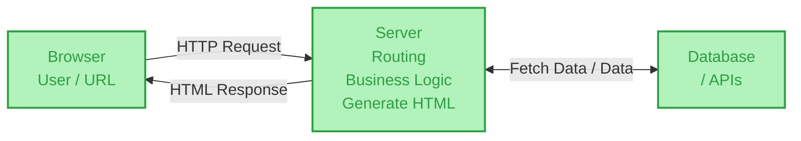

# 📖 The Definitive Guide to Multi-Page Applications (MPA)

> **The only architecture document you will ever need.**
> A masterclass on Multi-Page Applications: from raw browser internals and network lifecycles to security paradigms, caching hierarchies, and modern hybrid architectures. Written by Frontend Architects, for Frontend Architects.

[](https://example.com)
[](https://example.com)
[](https://example.com)

---

## 🧠 TL;DR (The 10-Second Mental Model)

If you forget everything else, remember this:

```text
MPA = Server-driven Document Navigation (The Book)
SPA = Client-driven Application Navigation (The Whiteboard)
```

**🚨 The #1 Interview Trap:**
**MPA is NOT the same as SSR.**
* **MPA** describes the *navigation architecture* (multiple documents).
* **SSR** describes the *rendering technique* (generating HTML on a server).

---

## 📑 Table of Contents

- [1. The Absolute Request Lifecycle](#1-the-absolute-request-lifecycle)
- [2. What Happens Inside the Browser?](#2-what-happens-inside-the-browser)
- [3. The Navigation Paradigm & State Paradox](#3-the-navigation-paradigm--state-paradox)
- [4. Security Architecture](#4-security-architecture)
- [5. Performance & Caching Realities](#5-performance--caching-realities)
- [6. The bfcache: MPA's Secret Weapon](#6-the-bfcache-mpas-secret-weapon)
- [7. Speculative Loading: Prefetch, Prerender & Speculation Rules](#7-speculative-loading-prefetch-prerender--speculation-rules)
- [8. Cross-Document View Transitions](#8-cross-document-view-transitions)
- [9. Core Web Vitals, MPA-Style](#9-core-web-vitals-mpa-style)
- [10. MPA vs. SPA: The Ultimate Matrix](#10-mpa-vs-spa-the-ultimate-matrix)
- [11. The Modern MPA (It's not 2005 anymore)](#11-the-modern-mpa-its-not-2005-anymore)
- [12. MPA and Micro-Frontends: Where They Meet](#12-mpa-and-micro-frontends-where-they-meet)
- [13. Interview Kill Shots](#13-interview-kill-shots)
- [14. Visual Architecture Map (Excalidraw Breakdown)](#14-visual-architecture-map-excalidraw-breakdown)
- [15. System Architecture Diagram](#15-system-architecture-diagram)
- [16. Deep-Dive Reference Index](#16-deep-dive-reference-index)

---

## 1. The Absolute Request Lifecycle

What happens when a user navigates to `https://example.com/products`?

```text
[ URL Bar ] → DNS → TCP/QUIC → TLS → HTTP Request
```

### The Server Gauntlet
The server doesn't just spit out HTML; it runs a strict pipeline:
1. **Routing:** Map `/products` → `ProductController`
2. **Authentication:** *Who is this?* (Validate Session Cookie)
3. **Authorization:** *What can they do?* (Check Permissions)
4. **Business Logic:** Apply pricing rules, check inventory.
5. **Data Fetching:** Execute `SELECT * FROM products`.
6. **Composition:** `Template + Data + Business Rules = HTML`.

### The HTTP Response
```http
HTTP/2 200 OK
Content-Type: text/html
Set-Cookie: session=abc123; Secure; HttpOnly; SameSite=Lax
Cache-Control: public, max-age=3600

<html>...</html>
```

---

## 2. What Happens Inside the Browser?

The server sends text. The browser does the heavy lifting to turn it into pixels.

```text
HTML Bytes ──▶ HTML Parser ──▶ DOM Tree
                                     │
CSS Bytes  ──▶ CSS Parser  ──▶ CSSOM Tree├─▶ Render Tree
                                     │       │
                                     └───────┴─▶ Layout (Box Model)
                                                 │
                                                 ▼
                                              Paint (Pixels)
                                                 │
                                                 ▼
                                           Compositing (GPU)
```
> **Architect's Note:** JavaScript execution can interrupt this flow, modifying the DOM/CSSOM and triggering expensive re-flows or re-paints.

---

## 3. The Navigation Paradigm & State Paradox

What happens when the user clicks `<a href="/cart">`?

```text
Current Document (/products)
        │
        ▼
Click Link → Browser DESTROYS current JS context & DOM
        │
        ▼
HTTP GET /cart → Server Gauntlet → New HTML
        │
        ▼
Browser builds NEW Document from scratch
```

### The State Paradox
Because the old document is destroyed, **in-memory UI state dies**. `const selectedFilter = "Laptops"` is gone forever.
**How to survive?** Push state to persistent layers:
* URL / Query Parameters
* Cookies
* Server Session
* `localStorage` / `sessionStorage`
* Backend Database

### Forms: The PRG Pattern
Never return HTML directly from a `POST` request. Use **Post/Redirect/Get (PRG)**:
`POST /checkout` → Server processes → `302 Redirect` → `GET /order-confirmation`.
*(Prevents double-submissions on refresh).*

---

## 4. Security Architecture

MPAs do not get a free pass on security. Here is how attacks map to the architecture:

### XSS (Cross-Site Scripting)
* **Threat:** Attacker injects `<script>stealCookie()</script>` into a product review.
* **Defense:** Output encoding, safe templating engines, and `Content-Security-Policy` headers.

### CSRF (Cross-Site Request Forgery)
* **Threat:** User visits `evil.com` while logged into `bank.com`. `evil.com` triggers ``. Browser auto-attaches the session cookie.
* **Defense:** Anti-CSRF tokens and `SameSite` cookie attributes.

### SQL Injection
* **Threat:** Because MPAs hit the database on nearly every request (step 5 of the Server Gauntlet), unsanitized input in a query (`WHERE id = ` + userInput) can let an attacker read or modify data outside the intended scope.
* **Defense:** Parameterized queries / prepared statements, an ORM that escapes by default, and least-privilege DB accounts. Never string-concatenate user input into SQL — this applies even more to MPAs than SPAs, since nearly every navigation is a fresh opportunity to hit the query layer.

### The Cookie Security Trinity
If you use session cookies, these three flags are non-negotiable:
1. `Secure`: Never sent over plaintext HTTP.
2. `HttpOnly`: Inaccessible via `document.cookie` (mitigates XSS theft).
3. `SameSite`: `Strict` or `Lax` (mitigates CSRF).

---

## 5. Performance & Caching Realities

### 🚫 Stop Saying: "MPAs are slow because they re-download CSS/JS on every page."
**Architect's Truth:** Browsers cache assets. On page 2, `app.css` is pulled from Disk/Memory Cache if `Cache-Control` headers are set correctly. Distinguish between **New Document** and **All Resources Downloaded**.

### The True Bottleneck
MPA latency comes from the **Server Round-Trip + Document Parse**:
```text
SPA Click: JS Router → Fetch API (JSON) → Update DOM [~50ms]
MPA Click: HTTP Request → Server DB/Logic → HTML Download → Parse HTML → Build DOM [~300ms+]
```

### The Caching Hierarchy (Memorize this)
```text
1. Browser Cache (Disk/Memory)     → ~1ms   (Fastest)
2. CDN / Edge Cache (Cloudflare)   → ~20ms  (Fast)
3. Reverse Proxy (Nginx/Varnish)   → ~50ms  (Medium)
4. Application Cache (Redis)       → ~2ms   (Medium, but adds logic)
5. Database (Postgres/Mongo)       → ~100ms (Slowest)
```
*Rule of thumb: If your CDN can serve the HTML, your MPA will beat an SPA every time.*

---

## 6. The bfcache: MPA's Secret Weapon

The **back/forward cache (bfcache)** is the most underrated MPA performance feature, and it's the honest answer to "doesn't clicking Back re-run the whole Server Gauntlet?"

* When a user navigates away, the browser can **freeze the entire page** (DOM, JS heap, scroll position) in memory instead of destroying it.
* Hitting Back/Forward restores it instantly — **no network request, no parse, no re-render.** This is different from the disk/memory *asset* cache in Section 5; it caches the whole page state, not just files.
* **What breaks it:** `unload` event listeners, `Cache-Control: no-store`, open WebSocket/IndexedDB transactions, and certain `Permissions-Policy` restrictions.
* **Architect's rule:** Prefer `pagehide` over `unload`, avoid `no-store` on pages that don't hold sensitive per-request state, and test bfcache eligibility in Chrome DevTools' Application panel.

This directly undercuts the old "MPA back button is slow" complaint — done right, it's often faster than an SPA route change.

---

## 7. Speculative Loading: Prefetch, Prerender & Speculation Rules

`<link rel="prefetch">` only fetches a raw document, without executing JS or applying styles. The modern replacement is the **Speculation Rules API**, which lets the browser prefetch *or fully prerender* a likely-next document in a hidden tab, based on declarative rules:

```html
<script type="speculationrules">
{
  "prerender": [{
    "where": { "href_matches": "/products/*" },
    "eagerness": "moderate"
  }]
}
</script>
```

* **Eagerness levels** (`conservative` / `moderate` / `eager`) control *when* a speculation fires — from "on pointerdown" to "on hover for ~200ms" to "as soon as the link is visible."
* It targets **document URLs**, which is precisely why it's designed for MPAs rather than SPAs (SPAs don't do full document fetches).
* **Support caveat:** Chromium-based browsers (Chrome, Edge, Opera) support it; Firefox silently ignores the `<script>` tag, making it a safe progressive enhancement.
* Combined with correct caching (Section 5) and CDN edge delivery, this is how modern MPAs hit sub-second navigations without a client-side router.

---

## 8. Cross-Document View Transitions

For years, "the page just fades/slides in" was an SPA-only trick, because animating *between two different documents* meant the old DOM was destroyed before the new one existed. The **View Transitions API** now supports this natively across navigations:

```css
/* On both the outgoing and incoming page */
@view-transition {
  navigation: auto;
}
```

* The browser snapshots the old document, snapshots the new one, and cross-fades between them — **zero JavaScript required.**
* **Support (2026):** Shipped in Chrome 126+ and Safari 18.2+. Firefox support is landing incrementally (partial as of v146+) — treat it as a progressive enhancement via `@supports (view-transition-name: none)`, not a dependency.
* **Same-origin only**, and both pages must opt in via the `@view-transition` rule.
* Pair this with Speculation Rules (Section 7): if the next document is already prerendered, the transition plays between two fully-rendered pages and feels instant — this combination is the biggest reason "MPAs feel clunky" is becoming outdated as an argument.

---

## 9. Core Web Vitals, MPA-Style

Because every navigation is a fresh document, MPA performance work maps directly onto Core Web Vitals — useful framing for both real audits and interviews:

| Metric | What it measures | Primary MPA lever |
| :--- | :--- | :--- |
| **LCP** (Largest Contentful Paint) | Time to render the biggest visible element | Server response time (TTFB), critical CSS, prerendering via Speculation Rules |
| **INP** (Interaction to Next Paint) | Responsiveness of the *current* page's interactions | Keep hydration/enhancement JS light; don't block the main thread during transitions |
| **CLS** (Cumulative Layout Shift) | Visual stability while loading | Reserve space for images/ads/fonts; be careful with `font-display` swaps |

A prerendered navigation can drop LCP dramatically compared to a cold navigation, since the HTML is already sitting in the browser's cache when the click happens — this is the measurable payoff of Sections 6–7, not just a theoretical one.

---

## 10. MPA vs. SPA: The Ultimate Matrix

| Feature | MPA (The Book) | SPA (The Whiteboard) |
| :--- | :--- | :--- |
| **Navigation Owner** | Browser & Server | Client-Side JS Router |
| **Document Count** | Multiple HTML files | Usually 1 `index.html` |
| **Initial Load** | Fast, meaningful content | Often an empty "App Shell" |
| **Subsequent Loads** | Full document cycle (mitigated by bfcache/prerender) | Instant (DOM Swap) |
| **SEO** | Native & Perfect | Requires SSR/Prerendering |
| **JS Bundle Size** | Small (or zero) | Massive (Frameworks/State) |
| **Memory State** | Dies on navigation (unless bfcache) | Lives in memory |
| **Complexity** | On the Server | On the Client |
| **Best For** | Blogs, E-com, Docs, Marketing | Figma, Gmail, Dashboards |

---

## 11. The Modern MPA (It's not 2005 anymore)

Modern architects don't build MPAs like it's the PHP era. We use modern tooling:

* **The Backend:** Go, Rust, Node.js, Python (FastAPI) — increasingly with **streaming SSR**, sending HTML in chunks as it's ready instead of waiting for the full render.
* **The Edge:** Rendering moved closer to the user via edge functions (Cloudflare Workers, Deno Deploy, Vercel Edge) — shrinking the "Server Round-Trip" bottleneck flagged in Section 5 by cutting physical distance, not just adding cache layers.
* **The Enhancements:** Alpine.js, Stimulus, or isolated React/Vue "Islands."
* **The Pattern: MPA + Partial Updates.** Instead of full document navigation, the server returns an HTML fragment, and a library swaps just that `<div>`:
  * **HTMX** — attribute-driven, framework-agnostic.
  * **Turbo (Hotwire)** — Rails-native, pairs "Turbo Drive" (full-page swaps) with "Turbo Frames/Streams" (partial swaps).
  
  Both get you SPA-like feelings with MPA robustness — pick based on backend ecosystem, not raw capability.

### Can React be used in an MPA?
**Yes.** React does not equal SPA. You can server-render a page, and only hydrate a single `<div id="cart-widget">` with React. The rest of the page remains standard MPA.

---

## 12. MPA and Micro-Frontends: Where They Meet

Micro-frontend architectures (Single-SPA, Module Federation) are often *client-side* compositions — multiple teams' bundles stitched into one SPA shell. But the same "multiple independently-owned pieces" philosophy has an MPA-native form:

* **Server-side composition:** an edge layer or reverse proxy (e.g., Nginx, a BFF) assembles a page from fragments owned by different teams/services *before* it reaches the browser — no client-side orchestration framework required.
* **Trade-off vs. client-side micro-frontends:** you lose in-memory cross-fragment state sharing (back to the State Paradox in Section 3), but you gain independent deployability *without* shipping every team's JS runtime to the browser.
* Some organizations run a hybrid: MPA navigation at the top level (page-to-page), with a micro-frontend shell mounted inside specific pages that need heavy client interactivity (dashboards, editors) — giving each page the architecture it actually needs instead of forcing one model everywhere.

---

## 13. Interview Kill Shots

**Q: "Is MPA always server-side rendered?"**
> *"No. MPA describes a multi-document navigation architecture. Pages can be statically pre-rendered (like Jekyll/Hugo) or use edge rendering. SSR is a rendering strategy; MPA is the navigation model."*

**Q: "Does MPA mean no JavaScript?"**
> *"Absolutely not. JavaScript enhances the page without owning the navigation lifecycle. You can have vanilla JS, Web Components, or framework widgets inside an MPA."*

**Q: "Why is MPA good for SEO?"**
> *"Because the HTTP response contains the final, meaningful HTML in the initial payload. Crawlers don't need to execute a JavaScript bundle to see the `<h1>` or content."*

**Q: "Why can MPA navigation be slower?"**
> *"Because it requires a full network round trip, server processing, database queries, and a complete browser document parse/render cycle — though bfcache and Speculation Rules close most of that gap in practice."*

**Q: "What happens to state during MPA navigation?"**
> *"In-memory JS state is destroyed with the document, unless the page qualifies for bfcache. To persist state deliberately, you rely on URLs, cookies, server sessions, or local storage."*

**Q: "How do modern MPAs compete with SPA-feeling transitions?"**
> *"Three features stack together: the Speculation Rules API prerenders the likely-next document, cross-document View Transitions animate between the two documents natively, and bfcache makes back/forward instant — no client router required."*

---

## 14. Visual Architecture Map (Excalidraw Breakdown)

> *The following diagrams are a native Markdown translation of the official [`MPA_Notes.excalidraw`](./MPA_Notes.excalidraw) companion file. They map the exact visual flows of an MPA.*

### A. Request / Server / Database Flow


### B. Browser Rendering Pipeline


### C. Document Navigation Lifecycle


### D. Authentication & Session Flow


### 📝 Excalidraw Core Summary Notes
> * Server handles routing and executes business logic.
> * Server fetches data and generates HTML.
> * Navigation generally loads a new document — unless served from bfcache or a prerendered speculation.
> * Initial HTML can be SEO-friendly; performance depends on server, network, DB/APIs and assets.
> * Security is not automatic: protect against XSS, CSRF, SQL injection, auth/session issues.

---

## 15. System Architecture Diagram

A production-ready Modern MPA infrastructure:

```text
                         ┌──────────────┐
                         │   BROWSER    │
                         │ (Cache+bfcache+DOM)│
                         └──────┬───────┘
                                │
                             HTTPS
                                │
                         ┌──────▼───────┐
                         │ CDN / Edge   │ ◄── Serves Static Assets, Cached HTML,
                         └──────┬───────┘     and runs Edge Rendering Functions
                                │
                     ┌──────────▼──────────┐
                     │ Load Balancer /     │
                     │ Reverse Proxy (SSL) │
                     └──────────┬──────────┘
                                │
                         ┌──────▼───────┐
                         │ Web Server /  │
                         │ App Controller│
                         │ (Routing/Auth)│
                         └──────┬───────┘
                                │
                  ┌─────────────┼─────────────┐
                  │             │             │
             ┌────▼────┐  ┌────▼────┐  ┌────▼────┐
             │ Redis   │  │ Micro   │  │ Database│
             │ Cache   │  │ Services│  │ (SQL)   │
             └─────────┘  └─────────┘  └─────────┘
```

---

## 16. Deep-Dive Reference Index

*Curated primary sources for deep reading:*
* [web.dev — SPA vs MPA architecture and trade-offs](https://web.dev/learn/pwa/architecture)
* [MDN — HTTP Cookies](https://developer.mozilla.org/en-US/docs/Web/HTTP/Guides/Cookies)
* [MDN — Session Management](https://developer.mozilla.org/en-US/docs/Web/Security/Authentication/Session_management)
* [MDN — CSRF](https://developer.mozilla.org/en-US/docs/Web/Security/Attacks/CSRF)
* [Google Search Central — JavaScript SEO Basics](https://developers.google.com/search/docs/crawling-indexing/javascript/javascript-seo-basics)
* [MDN — Speculation Rules API](https://developer.mozilla.org/en-US/docs/Web/API/Speculation_Rules_API)
* [Chrome for Developers — Prerender pages with Speculation Rules](https://developer.chrome.com/docs/web-platform/prerender-pages)
* [MDN — View Transition API](https://developer.mozilla.org/en-US/docs/Web/API/View_Transition_API)
* [web.dev — bfcache](https://web.dev/articles/bfcache)

---

**⭐ Star this repository if it helped you crack your system design or frontend architecture interview!**
