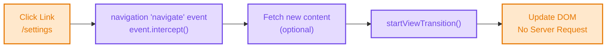
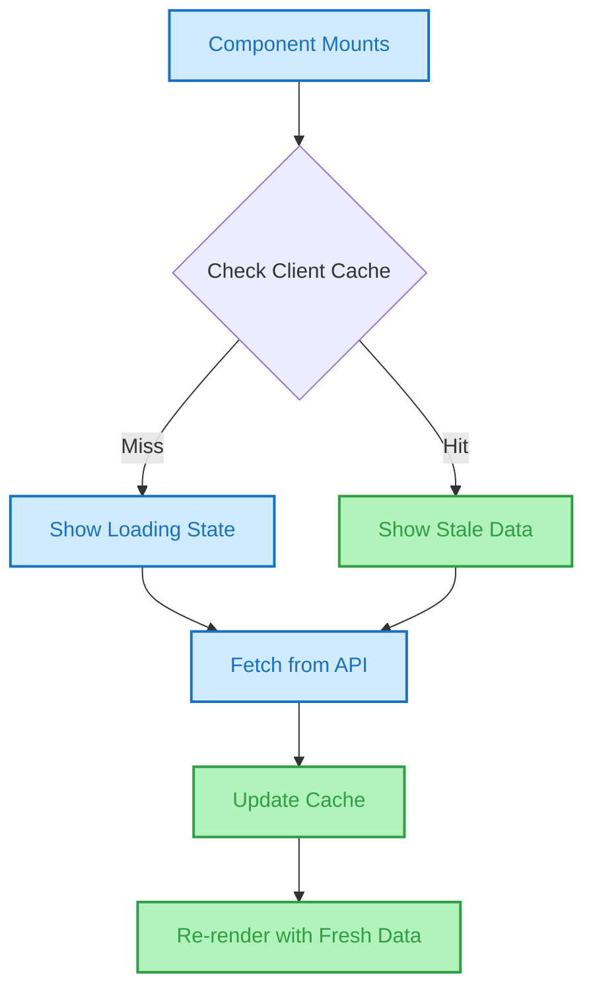
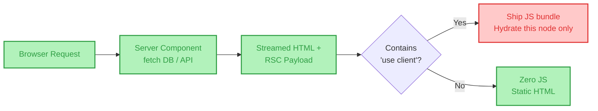

# 📖 The Definitive Guide to Single-Page Applications (SPA)

> **The only architecture document you will ever need.**
> A masterclass on Single-Page Applications: from the illusion of client-side routing and the Virtual DOM to state management paradigms, data-fetching layers, hydration mechanics, and modern performance optimizations. Written by Frontend Dec, for Frontend Dev.

[](https://example.com)
[](https://example.com)
[](https://example.com)

---

## 🧠 TL;DR (The 10-Second Mental Model)

If you forget everything else, remember this:

```text
MPA = Server-driven Document Navigation (The Book)
SPA = Client-driven Application Navigation (The Whiteboard)
```

**🚨 The #1 Interview Trap:**
**SPA is NOT the same as CSR (Client-Side Rendering).**
* **SPA** describes the *navigation architecture* (a single HTML document that persists across view changes).
* **CSR** describes the *rendering technique* (JavaScript building DOM in the browser).
* *An SPA can use SSR (Server-Side Rendering) and then hydrate on the client.*

**🚨 The #2 Interview Trap (new for 2026):**
**React Server Components have blurred the line entirely.** A modern Next.js App Router app *feels* like an SPA (client-side transitions, no full reload) but architecturally streams server-rendered fragments per navigation — closer to a hybrid than either camp. Know both models before you claim any app is "just an SPA."

---

## 📑 Table of Contents

- [1. The Core Mental Model: The Illusion of Pages](#1-the-core-mental-model-the-illusion-of-pages)
- [2. The Absolute Bootstrap Lifecycle](#2-the-absolute-bootstrap-lifecycle)
- [3. The Routing Engine: From History Hacks to the Navigation API](#3-the-routing-engine-from-history-hacks-to-the-navigation-api)
- [4. State Management: The Heart of the SPA](#4-state-management-the-heart-of-the-spa)
- [5. The Rendering Engine: Virtual DOM, Signals & Fine-Grained Reactivity](#5-the-rendering-engine-virtual-dom-signals--fine-grained-reactivity)
- [6. The Data Fetching Layer](#6-the-data-fetching-layer)
- [7. Performance Engineering: Fixing the SPA Bloat](#7-performance-engineering-fixing-the-spa-bloat)
- [8. The SEO Crisis & Modern Solutions](#8-the-seo-crisis--modern-solutions)
- [9. React Server Components & the Islands Alternative](#9-react-server-components--the-islands-alternative)
- [10. Security Architecture in SPAs](#10-security-architecture-in-spas)
- [11. MPA vs. SPA: The Ultimate Matrix](#11-mpa-vs-spa-the-ultimate-matrix)
- [12. Visual Architecture Map (Excalidraw Breakdown)](#12-visual-architecture-map-excalidraw-breakdown)
- [13. System Architecture Diagram](#13-system-architecture-diagram)
- [14. Interview Kill Shots](#14-interview-kill-shots)
- [15. Deep-Dive Reference Index](#15-deep-dive-reference-index)

---

## 1. The Core Mental Model: The Illusion of Pages

In an MPA, the URL dictates the document. In an SPA, **the URL is just a reflection of the application's state.**

When you navigate in an SPA, no new document is requested. Instead:
1. The JavaScript router intercepts the click.
2. The router updates the browser's URL using the History API (or, increasingly, the **Navigation API** — see Section 3).
3. The router updates the client-side state.
4. The UI re-renders to match the new state.

**The Architect's Truth:** An SPA is a desktop application pretending to be a website. The browser is merely a runtime environment (like Electron or Windows), and the HTML document is just the empty window frame.

---

## 2. The Absolute Bootstrap Lifecycle

What happens on the *very first* load of `https://app.example.com/dashboard`?

```text
[ URL Bar ] → DNS → TCP → TLS → HTTP Request
```

### The Server Response (The App Shell)
The server sends a nearly empty HTML file:
```html
<!DOCTYPE html>
<html>
  <head>
    <link rel="stylesheet" href="/app.css">
  </head>
  <body>
    <div id="root"></div>
    <script src="/main.bundle.js"></script>
  </body>
</html>
```

### The Client Gauntlet
The browser executes the heaviest pipeline in web development:
1. **Parse HTML:** Instant, because there's almost no HTML.
2. **Parse CSS:** Standard CSSOM creation.
3. **Download & Execute JS:** The bottleneck. The browser blocks rendering to download, parse, and compile the JavaScript bundle (often megabytes).
4. **Framework Bootstrap:** React/Vue/Angular initializes.
5. **Router Match:** The router looks at the URL (`/dashboard`) and determines which component tree to load.
6. **Data Fetching:** The component mounts and fires API calls (`GET /api/user`, `GET /api/data`).
7. **Render:** Data arrives → State updates → Virtual DOM calculates diff → Real DOM updates → Paint.

> **Architect's Note:** The user stares at a blank white screen (or a loading spinner inside `#root`) from Step 3 until Step 7. This is the **FOUC (Flash of Unstyled Content)** or **TTI (Time to Interactive)** problem.

---

## 3. The Routing Engine: From History Hacks to the Navigation API

### The Problem
Standard `<a href="/settings">` tags cause full document reloads. This destroys the SPA.

### The Old Solution: The History API
SPAs have long used `window.history.pushState()` and listened to the `popstate` event.

```javascript
// What happens when user clicks <Link to="/settings">
window.history.pushState({}, '', '/settings');

// The URL bar changes, but NO request is made to the server.
// The SPA router catches this and does this instead:
setState(<SettingsComponent />);
```

**🚫 Stop Saying:** "SPAs don't use URLs."
**Architect's Truth:** Good SPAs are deeply tied to URLs. If a user bookmarks `/settings` and opens it tomorrow, the server must serve the `index.html`, and the JS router must read the URL and render `<SettingsComponent />`.

### The Problem With the History API
`pushState`/`popstate` was never actually *designed* for SPAs — it's a workaround. Its known pain points: `popstate` doesn't fire for programmatic `pushState`/`replaceState` calls, you can't reliably distinguish a Back click from a Forward click, you can't read the full history stack, and you can't edit non-current entries. This is why every router (React Router, Vue Router) has to maintain its own internal navigation-tracking logic on top of it.

### The Modern Fix: The Navigation API
The **Navigation API** reached **Baseline Newly Available in early 2026** (Chrome, Edge, Firefox 147, Safari 26.2) as the purpose-built successor to `history`. It gives you one unified `navigate` event that catches *every* navigation — link clicks, back/forward, and programmatic calls — with the ability to intercept and control them centrally:

```javascript
navigation.addEventListener('navigate', (event) => {
  if (!event.canIntercept) return;
  const url = new URL(event.destination.url);

  event.intercept({
    async handler() {
      const content = await fetchNewPageContent(url.pathname);
      // Pairs naturally with cross-document View Transitions
      document.startViewTransition(() => {
        document.getElementById('app').innerHTML = content;
      });
    }
  });
});
```

* **Why it matters:** no more manually wiring `pushState` + `popstate` + `hashchange` into three separate code paths. One event, one mental model, and it composes cleanly with `document.startViewTransition()` for native page-transition animations.
* **Framework status:** as of 2026, React Router and TanStack Router both have open work to adopt the Navigation API as their internal backend rather than reimplementing History API workarounds — the router libraries stay for their real value-add (nested routes, data loading, error boundaries), not for papering over `history`'s gaps.
* **Caveat:** Safari 26.2 ships without `precommitHandler` support, which limits some advanced interception patterns — feature-detect with `"navigation" in window` and fall back to History API where needed.

### The `popstate` Event (still relevant as a fallback)
If the user clicks the browser's "Back" button on a browser without Navigation API support, the browser fires `popstate`. The SPA router listens for this, reads the new URL from `window.location`, and re-renders the old component.

---

## 4. State Management: The Heart of the SPA

Because the server only sends an empty shell, **the client is now the single source of truth for UI state.**

```text
UI = f(State)
```

### The State Tree
In a complex SPA (like Gmail or Figma), state is everywhere:
* **UI State:** Is the sidebar open? What is the active tab?
* **Server State:** The user's emails, their profile data.
* **URL State:** The current route, query filters (`?sort=asc`).
* **Form State:** Temporary input values before submission.
* **Cache State:** Data kept in memory to avoid re-fetching.

### The Flux / Redux Paradigm
To prevent chaotic state updates, SPAs enforce a unidirectional data flow:
```text
Action (User clicks)
      ↓
Dispatcher (Redux store)
      ↓
Reducer (Pure function calculates new state)
      ↓
State Update
      ↓
View Re-renders
```

---

## 5. The Rendering Engine: Virtual DOM, Signals & Fine-Grained Reactivity

If SPAs update the DOM constantly, why don't they use `document.createElement`?

### The Problem: Direct DOM Manipulation is O(n³)
Calculating the difference between two complex DOM trees natively is mathematically expensive.

### The Classic Solution: Virtual DOM (O(n))
Frameworks like React maintain a lightweight JavaScript copy of the DOM.
```text
1. State changes.
2. Framework creates a NEW Virtual DOM tree.
3. Framework diffs the NEW Virtual DOM against the OLD Virtual DOM (Reconciliation).
4. Framework calculates the minimal set of changes (e.g., "Change text of node #42").
5. Framework batches these changes and updates the Real DOM once.
```

### The Newer Solution: Signals & Fine-Grained Reactivity
By 2026, **signals-based reactivity** — SolidJS, Svelte 5 Runes, Angular Signals, Preact Signals — has moved from experimental to mainstream. Instead of diffing a whole component's virtual tree on every state change, a signal tracks *exactly which DOM nodes depend on it* and updates only those nodes directly, with no diffing pass at all.

```text
Virtual DOM model:  State change → re-render component → diff tree → patch DOM
Signals model:      State change → update the one subscribed DOM node directly
```

**Architect's distinction:** RSC (Section 9) is an *architectural* decision (where does this component render — server or client?). Signals are a *runtime execution model* (how does the client re-render when state changes?). They solve different problems and increasingly coexist — e.g., a Next.js App Router page with a SolidJS-powered interactive island is a real production pattern in 2026, not a novelty.

---

## 6. The Data Fetching Layer

Historically, SPAs fetched data in `useEffect` (React) or `mounted` hooks (Vue). This led to "Waterfalls" and "Loading Spinners."

### The Modern Standard: Stale-While-Revalidate (SWR)
Tools like React Query, SWR, or RTK Query manage *Server State* separately from *Client State*.

```text
1. Component mounts.
2. SWR checks Memory Cache.
   ├── HIT? → Render immediately with cached data.
   └── MISS? → Render with loading state.
3. SWR makes background API call.
4. API responds.
5. SWR updates cache AND triggers a re-render with fresh data.
```
**Architect's Truth:** SWR makes SPAs feel instantly fast, acting as a client-side database that synchronizes with the server.

---

## 7. Performance Engineering: Fixing the SPA Bloat

MPAs are slow on navigation; SPAs are slow on initial load. To fix this, architects use:

### 1. Code Splitting
Don't download the whole app at once.
```javascript
const Settings = React.lazy(() => import('./SettingsPage.js'));
// The Settings bundle is ONLY downloaded when the user navigates to /settings
```

### 2. Tree Shaking
Using ES Modules (`import/export`), bundlers (Webpack/Vite) mathematically eliminate code you don't use. If you import `lodash` but only use `sort`, tree shaking ensures `map` and `filter` aren't in your bundle.

### 3. Prefetching
When the user hovers over a `<Link to="/dashboard">`, the router silently downloads the `/dashboard` JS chunk. By the time they click, it's already in memory.

### 4. Watch INP, Not Just Load Time
**INP (Interaction to Next Paint)** replaced FID as a Core Web Vital in March 2024 and is now the standard responsiveness metric — it measures the delay of *every* interaction on the page, not just the first one. This matters more for SPAs than MPAs: a heavy state update or a synchronous reducer running on the main thread can freeze the whole app mid-session, long after initial load looked fine.
* **Fix:** break up long tasks (`scheduler.yield()` / chunking), move expensive computation off the main thread with **Web Workers**, and avoid large synchronous re-renders — this is exactly the problem fine-grained signals (Section 5) were designed to eliminate at the root.

---

## 8. The SEO Crisis & Modern Solutions

### The Problem
Google's crawler is a headless browser. If it executes your JS, it sees the UI. But:
1. Execution takes time (crawl budget).
2. Some crawlers (Bing, social media bots, Discord/Slack link previews) *do not* execute JS. They see an empty `<div id="root">`.

### Solution 1: Pre-rendering (Prerender.io / Rendertron)
A bot visits your SPA, waits for JS to execute, takes a snapshot of the HTML, and serves *that* static HTML to crawlers. (Good for low-variable sites).

### Solution 2: SSR + Hydration (Next.js / Nuxt)
The server runs your React/Vue code *on the server*, generates full HTML, sends it to the browser (instant paint, great for SEO), and then sends the JS bundle. The JS "attaches" itself to the existing HTML. This attachment process is called **Hydration**.

**🚨 The Hydration Warning:**
If the server-generated HTML does not perfectly match the client-generated Virtual DOM, React throws a hydration error and re-renders from scratch, destroying the SEO/performance benefit.

### Solution 3: Resumability (Qwik) — Skipping Hydration Entirely
Hydration re-executes your whole component tree on the client just to attach event listeners — expensive even if the HTML was already correct. **Resumable** frameworks like Qwik serialize the application's execution state into the HTML itself, so the client can "resume" exactly where the server left off and attach a listener to a single button *without* re-running the rest of the app. Still a minority pattern in 2026, but the clearest sign of where hydration's cost is pushing framework design.

---

## 9. React Server Components & the Islands Alternative

This is the architectural shift that makes "is this an SPA?" a harder question to answer than it used to be.

### React Server Components (RSC)
RSC lets individual components render **only on the server** — they fetch data directly, never ship their JS to the browser, and stream their output into the page. A component only becomes a client bundle if it's explicitly marked `'use client'`.

```text
Server Component (green): fetches data, renders HTML, ships ZERO JS
Client Component (red):   needs useState/useEffect/browser APIs, ships JS
```

**Architect's rule of thumb (2026 best practice):** a healthy component tree is ~90% server/green. If it's closer to 50/50, you've built a React SPA wearing a Next.js costume, and you pay the bundle-size penalty on every load regardless.

* **Real-world payoff:** HTTP Archive data shows the median React SPA ships 400–600 KB of JS; teams adopting RSC report cutting that to 150–250 KB — without losing functionality.
* **Status:** Next.js ships RSC as the default as of Next.js 15, and it's now the most common React setup in production. Remix v3 has adopted it too, though it's still maturing there.
* **The cost:** RSC pushes real architectural weight onto the server boundary — data-fetching, caching, and secrets management move into territory frontend teams didn't traditionally own. Serialization errors across the server/client boundary are the most common adoption pitfall.

### The Islands Architecture Alternative (Astro)
Islands architecture approaches the same goal — *don't ship JS for content that doesn't need it* — from the opposite direction: **zero JS by default**, and you explicitly opt individual components into hydration (`client:load`, `client:visible`, etc.), rather than opting components *out* of the client bundle like RSC does.

| | RSC (Next.js) | Islands (Astro) |
| :--- | :--- | :--- |
| **Default** | Client-first, opt into server | Server-first, opt into client |
| **Best for** | Interactive apps — SaaS dashboards, complex UIs | Content-heavy sites — blogs, marketing, docs |
| **Framework lock-in** | React-native | Framework-agnostic (React/Vue/Svelte islands in one app) |

### Where does this leave "the SPA"?
Per the State of React 2025 survey, SPAs are still what most teams say they build (84%), but SSR (61%), SSG (44%), partial hydration (25%), and streaming SSR (18%) are all in active use *within* those same codebases. The honest 2026 answer: pure client-only SPA and pure server-driven MPA are now the two ends of a spectrum, and most production apps — including RSC-based Next.js apps — sit somewhere in the middle, using client-side transitions (SPA-like feel) over a server-streamed component tree (MPA-like data flow).

---

## 10. Security Architecture in SPAs

MPAs rely on Cookies and Server Sessions. SPAs usually consume APIs, requiring a shift in security.

### Authentication: JWTs vs Cookies
SPAs often use JSON Web Tokens (JWTs) stored in memory or `localStorage`.
* **Vulnerability:** If stored in `localStorage`, any XSS attack instantly steals the token.
* **Architect's Fix:** Store JWTs in `HttpOnly`, `Secure`, `SameSite` cookies, exactly like an MPA. The SPA sends the request, the browser auto-attaches the cookie. **Never store sensitive tokens in `localStorage`.**

### The XSS Threat is Magnified
Because the SPA *is* JavaScript, an XSS vulnerability doesn't just steal a cookie; the attacker can literally hijack the entire application state, read private API responses, and trigger unauthorized actions as the user.

### CSRF is Mitigated (by default)
If your SPA consumes a JSON API, browsers enforce CORS (Cross-Origin Resource Sharing). A malicious site cannot easily forge a `POST` request with `application/json` to your API because the preflight `OPTIONS` request will fail. *(Note: CSRF is still possible if you use cookie auth and accept `multipart/form-data`).*

### RSC Adds a New Attack Surface
Server Components fetch data directly from databases and internal services inside the render path — meaning secrets and query logic that used to live safely behind an API gateway now live inside component code. **Architect's fix:** treat the server/client boundary as a security boundary too, not just a performance one — audit every `'use client'` line for what data crosses it.

---

## 11. MPA vs. SPA: The Ultimate Matrix

| Feature | MPA (The Book) | SPA (The Whiteboard) |
| :--- | :--- | :--- |
| **Navigation Owner** | Browser & Server | Client-Side JS Router (increasingly the Navigation API) |
| **Document Count** | Multiple HTML files | Usually 1 `index.html` |
| **Initial Load** | Fast, meaningful content | Often an empty "App Shell" (unless RSC/SSR) |
| **Subsequent Loads** | Full document cycle | Instant (DOM Swap) |
| **SEO** | Native & Perfect | Requires SSR/RSC/Prerendering |
| **JS Bundle Size** | Small (or zero) | Massive — unless RSC/Islands trim it |
| **Memory State** | Dies on navigation | Lives in memory |
| **Complexity** | On the Server | On the Client (or split, with RSC) |
| **Best For** | Blogs, E-com, Docs, Marketing | Figma, Gmail, Dashboards |

---

## 12. Visual Architecture Map (Excalidraw Breakdown)

> *The following diagrams map the exact visual flows of a modern SPA architecture.*

### A. The Bootstrap & Render Flow


### B. Client-Side Navigation Flow (via the Navigation API)


### C. Modern Data Fetching (SWR / React Query)


### D. RSC Request Path (Server-First Component Tree)


### 📝 Core SPA Summary Notes
> * Navigation happens via JavaScript, intercepting standard browser behavior — natively supported now via the Navigation API rather than History API workarounds.
> * The browser never requests a new document after the initial bootstrap (unless RSC streams a new server pass per navigation).
> * State is managed entirely on the client (UI state + cached server state), though RSC shifts data-fetching state back to the server.
> * Initial load is heavy (JS parsing/compiling) unless RSC/Islands trim the bundle; subsequent navigation is instant.
> * Security shifts heavily toward preventing XSS, managing tokens correctly, and — with RSC — auditing the server/client data boundary.

---

## 13. System Architecture Diagram

A production-ready Modern SPA infrastructure:

```text
                         ┌──────────────┐
                         │   BROWSER    │
                         │ (JS Runtime) │
                         └──────┬───────┘
                                │
                      1. Get App Shell (HTML/CSS)
                      2. Get JS Bundles (chunks, RSC-trimmed)
                      3. JSON API Calls / RSC Payload Streams
                                │
                         ┌──────▼───────┐
                         │ CDN / Edge   │ ◄── Caches static JS/CSS/HTML assets
                         └──────┬───────┘
                                │ (API/RSC calls bypass CDN)
                     ┌──────────▼──────────┐
                     │ API Gateway / BFF   │ ◄── Backend-For-Frontend
                     │ (Auth, Rate Limit)  │
                     └──────────┬──────────┘
                                │
                         ┌──────▼───────┐
                         │  API Servers  │
                         │  (Microservices)
                         └──────┬───────┘
                                │
                  ┌─────────────┼─────────────┐
                  │             │             │
             ┌────▼────┐  ┌────▼────┐  ┌────▼────┐
             │ Redis   │  │ Message │  │ Database│
             │ (Cache) │  │ Queue   │  │ (SQL)   │
             └─────────┘  └─────────┘  └─────────┘
```

---

## 14. Interview Kill Shots

**Q: "Why is my SPA initial load so slow?"**
> *"The browser must download, parse, and compile the JavaScript bundle before it can render anything meaningful. To fix this, we need Code Splitting (lazy loading routes), Tree Shaking, and either SSR or React Server Components to send pre-built HTML — with RSC also cutting the actual bundle size shipped, not just the timing."*

**Q: "How does routing work in an SPA without querying the server?"**
> *"Historically the HTML5 History API — `pushState()`/`popstate` — intercepting link clicks and manually updating the URL bar. As of 2026, the Navigation API is Baseline Newly Available and gives a single `navigate` event that catches every navigation type centrally, which is what modern router libraries are migrating onto."*

**Q: "What is Hydration, and is it still necessary?"**
> *"Hydration is the process of attaching event listeners and state to server-rendered HTML. It's still the dominant model, but it has a real cost: the client re-executes the component tree just to wire up listeners. Resumable frameworks like Qwik avoid this by serializing execution state into the HTML so the client can resume without re-running everything."*

**Q: "Where should I store authentication tokens in an SPA?"**
> *"Never in `localStorage` due to XSS vulnerabilities. Ideally, `HttpOnly`, `Secure`, `SameSite` cookies, just like an MPA. If you must use JWTs, keep them in memory with silent refresh tokens in cookies."*

**Q: "What's the difference between React Server Components and traditional SSR?"**
> *"SSR renders the whole page to HTML once per request and then hydrates the whole client bundle. RSC lets individual components stay server-only permanently — they never ship JS at all — while only explicitly marked `'use client'` components hydrate. SSR is a rendering pass; RSC is a per-component architectural boundary."*

**Q: "Is a Next.js App Router app an SPA or an MPA?"**
> *"Neither, cleanly. Client-side transitions between pages feel SPA-like, but each navigation can trigger a server-streamed RSC payload — closer to the MPA model of 'the server decides what HTML this view gets.' By 2026 this hybrid is the norm, not the exception, which is why the SPA-vs-MPA question is increasingly 'which parts of this app behave like which.'"*

---

## 15. Deep-Dive Reference Index

*Curated primary sources for deep reading:*
* [Web.dev — App Architecture](https://web.dev/learn/pwa/architecture/) (Comparison of MPA/SPA)
* [React Docs — reconciler](https://react.dev/reference/react-dom/client/createRoot) (How Virtual DOM works)
* [MDN — Navigation API](https://developer.mozilla.org/en-US/docs/Web/API/Navigation_API) (Baseline Newly Available, 2026)
* [web.dev — Navigation API is now Baseline](https://web.dev/blog/baseline-navigation-api)
* [Google Search Central — Dynamic Rendering](https://developers.google.com/search/docs/crawling-indexing/javascript/javascript-seo-basics) (Fixing SPA SEO)
* [Auth0 — Token Storage](https://auth0.com/docs/security/data-security/token-storage) (Why not localStorage)
* [web.dev — INP (Interaction to Next Paint)](https://web.dev/articles/inp)

---

**⭐ Star this repository if it helped you crack your system design or frontend architecture interview!**
