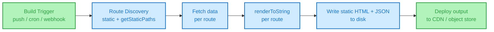
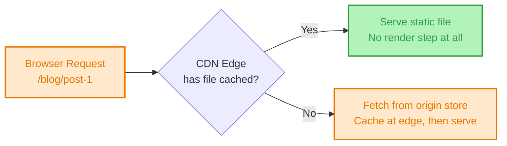
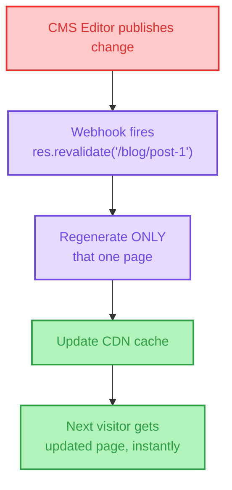

# 📖 The Definitive Guide to Static Site Generation (SSG)

> **The only architecture document you will ever need.**
> A masterclass on Static Site Generation: from the build-time rendering model and the CDN-first delivery pipeline to Incremental Static Regeneration, on-demand revalidation, and the hybrid rendering matrix. Written by Frontend Dev, for Frontend Dev.

[](https://example.com)
[](https://example.com)
[](https://example.com)

---

## 🧠 TL;DR (The 10-Second Mental Model)

If you forget everything else, remember this:

```text
SSR = Server builds the page ON EVERY REQUEST (The Custom Print Job)
SSG = Server builds every page ONCE, AT BUILD TIME (The Pre-Printed Book)
```

**🚨 The #1 Interview Trap:**
**SSG is NOT "just SSR that happens early."** They solve different problems.
* **SSR** trades server cost *per request* for freshness — every visitor triggers a render.
* **SSG** trades freshness for *zero* per-request server cost — the render happened once, at build time, and every visitor since gets the identical pre-built file straight from a CDN edge node.
* *You cannot personalize per-user in pure SSG — there is no request-time server step to key off. That gap is exactly what ISR and on-demand revalidation exist to close (Section 6).*

**🚨 The #2 Interview Trap (new for 2026):**
**"Static" no longer means "frozen forever."** Modern SSG isn't a one-time `npm run build` — Incremental Static Regeneration, on-demand revalidation webhooks, and per-page rebuild granularity mean a "static" site can update specific pages within seconds of a CMS edit, without a full rebuild. Know the difference between build-time SSG and ISR before calling any of it "static."

---

## 📑 Table of Contents

- [1. The Core Mental Model: The Pre-Printed Book](#1-the-core-mental-model-the-pre-printed-book)
- [2. The Absolute Build Lifecycle](#2-the-absolute-build-lifecycle)
- [3. The Request Lifecycle (Post-Build)](#3-the-request-lifecycle-post-build)
- [4. Dynamic Routes at Build Time: getStaticPaths](#4-dynamic-routes-at-build-time-getstaticpaths)
- [5. The Staleness Problem](#5-the-staleness-problem)
- [6. Incremental Static Regeneration & On-Demand Revalidation](#6-incremental-static-regeneration--on-demand-revalidation)
- [7. The Build-Time Scaling Wall](#7-the-build-time-scaling-wall)
- [8. SSG and Client-Side Interactivity: Islands & Hydration](#8-ssg-and-client-side-interactivity-islands--hydration)
- [9. SSG vs SSR vs CSR vs ISR: The Ultimate Matrix](#9-ssg-vs-ssr-vs-csr-vs-isr-the-ultimate-matrix)
- [10. Visual Architecture Map](#10-visual-architecture-map)
- [11. System Architecture Diagram](#11-system-architecture-diagram)
- [12. Interview Kill Shots](#12-interview-kill-shots)
- [13. Deep-Dive Reference Index](#13-deep-dive-reference-index)

---

## 1. The Core Mental Model: The Pre-Printed Book

In SSR, every request re-runs the render pipeline — route match, data fetch, `renderToString`, response — for *every visitor, every time*.

SSG removes the request from the equation entirely. At **build time** (not request time), the generator runs your component tree once per route, fetches whatever data that route needs, and writes the finished HTML to disk as a static file:

```text
Build time:    /about.html, /blog/post-1.html, /blog/post-2.html  ← all written once
Request time:  CDN just serves the matching file. No server render step at all.
```

**The Architect's Truth:** the server (or build machine) does the exact same work an SSR server does — routing, data fetching, `renderToString` — just once, ahead of time, instead of once per visitor. The output is byte-identical for every visitor until the next build. This is *why* it's fast: you've moved the entire render cost out of the request path.

**Why it's needed:**
* Fastest possible first paint — the CDN edge serves a finished file, zero server compute per request
* Perfect SEO — full HTML, no render step, no timing dependency
* Trivially scalable — a CDN can serve a static file to a million concurrent users the same way it serves one; there's no origin server to overload
* Cheapest hosting — no per-request compute means no server bill scaling with traffic

---

## 2. The Absolute Build Lifecycle

What happens when you run `next build` / `astro build` / `gatsby build`?

```text
[ Build Trigger ] → CI/CD pipeline starts (push, cron, webhook)
```

### The Build Gauntlet
1. **Route discovery:** the generator finds every route to build — static routes (`/about`) directly, dynamic routes (`/blog/[slug]`) via `getStaticPaths`/`generateStaticParams` (Section 4)
2. **Data fetch, per route:** for each route, fetch exactly the data that page needs — a CMS API call, a markdown file read, a DB query
3. **Render, per route:** run the component tree through the same render pipeline SSR would use (`renderToString` under the hood), producing a finished HTML string
4. **Write to disk:** the HTML (plus a JSON data payload for client-side hydration/navigation) is written as a static file — `/blog/post-1.html`, `/blog/post-1.json`
5. **Asset optimization:** images, CSS, JS bundles are hashed, minified, and fingerprinted for long-term caching
6. **Deploy:** the entire output directory is pushed to a CDN/object store (Vercel, Netlify, Cloudflare Pages, S3+CloudFront)

> **Architect's Note:** this entire pipeline runs on a build server, never in front of a real user. If step 2's API call fails or times out, the *build* fails — no user ever sees a broken page, but no user gets a new page either until you fix and re-run the build. This is the direct trade-off for "zero per-request server cost."

---

## 3. The Request Lifecycle (Post-Build)

What happens when a real visitor hits `/blog/post-1` *after* the build above has completed?

```text
[ URL Bar ] → DNS → TCP → TLS → HTTP Request
        │
        ▼
CDN Edge Node (nearest to the user)
        │
   Has /blog/post-1.html?
        │
   ┌────┴────┐
  YES         NO (cache miss / not yet propagated)
   │           │
Serve file    Fetch from origin object store → cache at edge → serve
   │
   ▼
Browser paints finished HTML immediately
```

**No server render step happens here at all.** This is the fundamental difference from Section 2 in the SSR doc — there is no "Server Gauntlet" per request, because it already ran, once, during the build.

---

## 4. Dynamic Routes at Build Time: `getStaticPaths`

SSG's hardest conceptual leap: how do you pre-build a page like `/blog/[slug]` when `slug` is dynamic and could be anything?

**The answer:** you tell the generator, at build time, the *full list* of values `slug` will take — usually by querying the same CMS/database the pages themselves will read from:

```javascript
// Next.js Pages Router example
export async function getStaticPaths() {
  const posts = await cms.getAllPosts(); // fetched ONCE, at build time
  return {
    paths: posts.map(post => ({ params: { slug: post.slug } })),
    fallback: false, // or 'blocking' / true — see below
  };
}

export async function getStaticProps({ params }) {
  const post = await cms.getPostBySlug(params.slug);
  return { props: { post } };
}
```

This runs once per known slug, producing one static HTML file per blog post — `/blog/hello-world.html`, `/blog/second-post.html`, etc.

**The `fallback` decision, and why it matters:**

| `fallback` value | Behavior for an unknown slug |
| :--- | :--- |
| `false` | 404 immediately — the path list from build time is exhaustive and final |
| `true` | Serve a loading state, render on first request in the background, cache the result for all future requests |
| `'blocking'` | Server-render on first request (like SSR, once), cache the result — no loading-state flash |

`fallback: true`/`'blocking'` is effectively a controlled escape hatch from pure SSG into "render on first request, then freeze it" — the conceptual seed of ISR (Section 6).

---

## 5. The Staleness Problem

This is SSG's core trade-off, and the one every interview question circles back to.

**The scenario:** your CMS content changes — an editor fixes a typo, updates a price, publishes a new post. Your static files were written at the *last* build. Nothing about editing the CMS re-triggers a build automatically.

```text
Build happens at 9:00 AM  → HTML written, deployed
CMS edit happens at 9:15 AM → static files are now WRONG
Next build isn't until tomorrow's cron → users see stale content for ~23 hours
```

**🚫 Stop Saying:** "SSG means the content is always correct because it's pre-built and tested."
**Architect's Truth:** pre-built means pre-*frozen*. Correctness at build time says nothing about correctness five minutes later. Staleness isn't a bug in SSG — it's the direct, unavoidable cost of moving rendering out of the request path. Every mitigation in Section 6 exists purely to manage this trade-off, not eliminate it.

**The classic mitigations, in order of sophistication:**
1. **Scheduled rebuilds** (cron, e.g. hourly) — simple, but content is stale for up to the interval length, and you rebuild *every* page even if only one changed
2. **Webhook-triggered full rebuilds** — CMS fires a webhook on publish, CI rebuilds the whole site — fresher, but wasteful at scale (Section 7) and slow for large sites
3. **Incremental Static Regeneration** — rebuild only the pages that actually changed, without a full site rebuild (Section 6)

---

## 6. Incremental Static Regeneration & On-Demand Revalidation

**ISR** (popularized by Next.js, with equivalents like Astro's on-demand rendering and Gatsby's DSG) solves staleness without giving up SSG's performance profile, using two mechanisms:

### Time-based revalidation
```javascript
export async function getStaticProps() {
  const post = await cms.getPost();
  return {
    props: { post },
    revalidate: 60, // seconds
  };
}
```
The static file is served as-is for up to 60 seconds. After that window, the *next* request triggers a background regeneration — that visitor still gets the (slightly stale) cached file instantly, but the regenerated file replaces it for everyone after. This is **stale-while-revalidate**, applied to whole pages instead of API responses.

### On-demand revalidation (webhook-triggered, no polling)
```javascript
// API route, called by a CMS webhook the instant an editor publishes
export default async function handler(req, res) {
  await res.revalidate('/blog/post-1');
  return res.json({ revalidated: true });
}
```
No interval, no guessing — the exact page that changed gets regenerated within seconds of the actual edit, and *only* that page. This is the direct answer to Section 7's scaling wall: you never rebuild pages that didn't change.

**Architect's rule of thumb:** time-based revalidation for content that changes unpredictably and where a short staleness window is acceptable (a blog); on-demand revalidation for content where "instantly correct after publish" actually matters (pricing pages, inventory, breaking news).

---

## 7. The Build-Time Scaling Wall

**The problem SSG doesn't advertise:** build time scales with page count. A documentation site with 50 pages builds in seconds. An e-commerce catalog with 500,000 product pages, each requiring a data fetch, can take *hours* to fully rebuild — and a full rebuild is traditionally required to update even one page.

```text
50 pages   × ~200ms/page fetch+render  ≈  10 seconds
500,000 pages × ~200ms/page fetch+render  ≈  ~28 hours (naive, unparallelized)
```

**Real mitigations used in production:**
* **Parallelized builds** — most modern generators fetch/render pages concurrently, not sequentially, cutting wall-clock time substantially (though origin API rate limits often become the new bottleneck)
* **Incremental builds** — only rebuild pages whose source content actually changed since the last build, rather than every page every time (Next.js, Gatsby, and Astro all support variants of this)
* **On-demand ISR instead of full rebuilds** — as in Section 6, regenerate only the specific page that changed, sidestepping the "rebuild everything" cost entirely
* **`fallback: 'blocking'` for long-tail pages** — for catalogs with a huge number of rarely-visited pages, don't pre-build all of them; build the popular ones at build time and generate the rest on first request, caching thereafter

---

## 8. SSG and Client-Side Interactivity: Islands & Hydration

A static HTML file is not interactive on its own — the same hydration mechanics from the SSR doc apply here. The static HTML ships, then a JS bundle downloads and `hydrateRoot`-equivalent logic attaches listeners.

**The key architectural choice SSG-focused frameworks make differently than SSR frameworks: how much of the page actually needs to hydrate at all.**

* **Next.js/Gatsby (React-based SSG):** typically hydrates the *entire* page's component tree, same as SSR — even if 95% of a blog post is static prose with zero interactivity.
* **Astro (Islands Architecture):** ships **zero JS by default**. You explicitly opt individual components into hydration — `client:load`, `client:visible`, `client:idle` — so a blog post with one interactive comment widget ships JS for *only* that widget, not the surrounding article text.

```text
React SSG page:  [ Header ][ Article body ][ Comment widget ][ Footer ]
                  └──────────── entire tree hydrates ────────────┘

Astro island page: [ Header ][ Article body ][ Comment widget ][ Footer ]
                     (static)   (static)      └── only this hydrates ──┘
```

This distinction matters more for SSG than SSR, precisely because SSG content is disproportionately static-by-nature (blogs, docs, marketing) — the islands model is a closer fit to what's actually being built.

---

## 9. SSG vs SSR vs CSR vs ISR: The Ultimate Matrix

| Feature | CSR | SSR | SSG (pure) | ISR |
| :--- | :--- | :--- | :--- | :--- |
| **When rendering happens** | Client, on every visit | Server, on every request | Build time, once | Build time, then re-triggered per-page |
| **First paint** | Slow (blank until JS runs) | Fast | Fastest — CDN edge file, zero compute | Fastest (cache hit) |
| **Data freshness** | Always fresh | Always fresh | Stale until next full build | Fresh within the revalidation window/on-demand |
| **Server cost per request** | None (static shell only) | High — renders every request | None — CDN serves a file | Near-zero — only regenerates on trigger |
| **Scales to huge traffic spikes** | Yes (client does the work) | Requires scaling server compute | Trivially — it's just CDN file serving | Trivially — same as SSG between regenerations |
| **Personalization per-user** | Yes, client-side | Yes, request-time | No — output is identical for everyone | No — regenerated output still shared across all visitors |
| **Best for** | Internal tools, auth-gated dashboards | Per-request/personalized content | Blogs, docs, marketing, catalogs that change rarely | Content that changes but doesn't need per-request rendering |

---

## 10. Visual Architecture Map

### A. The Build-Time Pipeline


### B. The Request Path (Zero Server Compute)


### C. ISR Revalidation Flow


### 📝 Core SSG Summary Notes
> * SSG moves rendering out of the request path entirely — the cost is paid once, at build time, not per visitor.
> * "Static" doesn't mean "frozen forever" once ISR/on-demand revalidation are in play — it means "not rendered per-request."
> * Staleness is the fundamental trade-off, not a bug — every mitigation (scheduled rebuilds, webhooks, ISR) manages it, none eliminate it entirely.
> * Build time scales with page count — this is SSG's real scaling wall, addressed by incremental builds and on-demand ISR.
> * Static HTML still needs hydration for interactivity — Islands Architecture (Astro) hydrates only what's actually interactive, unlike full-tree hydration in React-based SSG.

---

## 11. System Architecture Diagram

A production-ready SSG + ISR infrastructure:

```text
                         ┌──────────────┐
                         │   BROWSER    │
                         └──────┬───────┘
                                │ HTTPS GET /blog/post-1
                         ┌──────▼───────┐
                         │ CDN / Edge   │ ◄── Serves static HTML/JSON directly
                         │ (Cache Layer)│     No origin hit on cache HIT
                         └──────┬───────┘
                                │ (cache MISS or revalidation trigger)
                     ┌──────────▼──────────┐
                     │ Origin / Build       │
                     │ Server (regenerate   │ ◄── Runs renderToString once
                     │ single page for ISR) │     per triggered page
                     └──────────┬──────────┘
                                │
                  ┌─────────────┼─────────────┐
                  │             │             │
             ┌────▼────┐  ┌────▼────┐  ┌────▼────┐
             │ CMS /   │  │ Object  │  │ Webhook │
             │ Content │  │ Store   │  │ Receiver│
             │ Source  │  │ (built  │  │ (on-    │
             │         │  │ files)  │  │ demand) │
             └─────────┘  └─────────┘  └─────────┘
```

---

## 12. Interview Kill Shots

**Q: "How is SSG different from SSR?"**
> *"Both produce full HTML using the same render pipeline — the difference is entirely about *when*. SSR renders on every request, so it's always fresh but costs server compute per visitor. SSG renders once at build time, so every visitor since gets an identical pre-built file served straight from a CDN with zero server compute — at the cost of the content going stale until the next build."*

**Q: "How do you handle content that changes after the site is built?"**
> *"Depends how fresh it needs to be. Scheduled rebuilds are the simplest fix but leave a staleness window. Webhook-triggered full rebuilds are fresher but wasteful at scale. The production answer is usually Incremental Static Regeneration — either time-based revalidation for a short acceptable staleness window, or on-demand revalidation triggered by a CMS webhook the instant something publishes, which regenerates only that one page."*

**Q: "How does SSG handle a dynamic route like `/blog/[slug]` with thousands of posts?"**
> *"`getStaticPaths` (or `generateStaticParams`) fetches the full list of known slugs at build time and pre-builds one static file per slug. For routes not in that known list, the `fallback` setting decides the behavior — 404 immediately, show a loading state and render-then-cache on first request, or block and server-render once before caching. That fallback behavior is effectively the conceptual seed of ISR."*

**Q: "Why can't you fully personalize a page with pure SSG?"**
> *"Because personalization needs a request-time signal — who's asking — and SSG's entire performance model depends on there being no request-time step at all; the file is identical for every visitor. The moment you need per-user output, you've stepped outside pure SSG into SSR, edge middleware, or client-side personalization layered on top of a static shell."*

**Q: "What's the real scaling limitation of SSG?"**
> *"Not runtime performance — that's excellent, since it's just CDN file serving. It's build time. A catalog with hundreds of thousands of pages can take hours to fully rebuild if every page requires a data fetch. The fix is incremental builds that only rebuild changed pages, and on-demand ISR that regenerates a single page without touching the rest of the site."*

**Q: "Does a static site ship zero JavaScript?"**
> *"Only if the framework is built that way — Astro's Islands Architecture ships zero JS by default and you opt individual components into hydration. React-based SSG (Next.js, Gatsby) typically still hydrates the full page's component tree client-side, the same as SSR would, even though most of the content is non-interactive prose."*

---

## 13. Deep-Dive Reference Index

*Curated primary sources for deep reading:*
* [Next.js — Static Site Generation (getStaticProps)](https://nextjs.org/docs/pages/building-your-application/data-fetching/get-static-props)
* [Next.js — Incremental Static Regeneration](https://nextjs.org/docs/pages/building-your-application/data-fetching/incremental-static-regeneration)
* [Next.js — On-Demand Revalidation](https://nextjs.org/docs/pages/building-your-application/data-fetching/incremental-static-regeneration#on-demand-revalidation)
* [Astro Docs — Islands Architecture](https://docs.astro.build/en/concepts/islands/)
* [Astro Docs — On-demand Rendering](https://docs.astro.build/en/guides/on-demand-rendering/)
* [Gatsby Docs — Deferred Static Generation](https://www.gatsbyjs.com/docs/how-to/rendering-options/using-deferred-static-generation/)
* [web.dev — Rendering on the Web](https://web.dev/articles/rendering-on-the-web)

---

**⭐ Star this repository if it helped you crack your system design or frontend architecture interview!**
