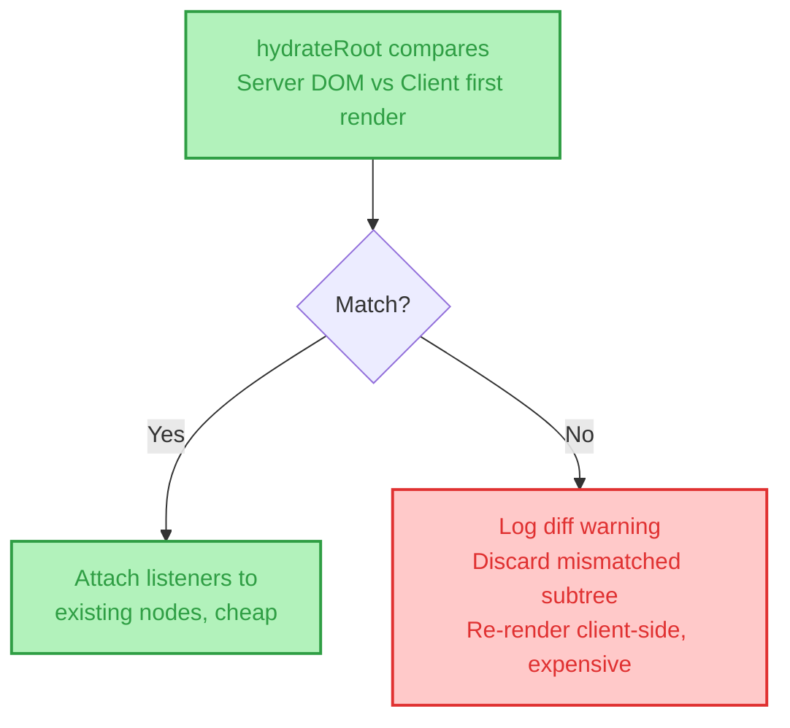
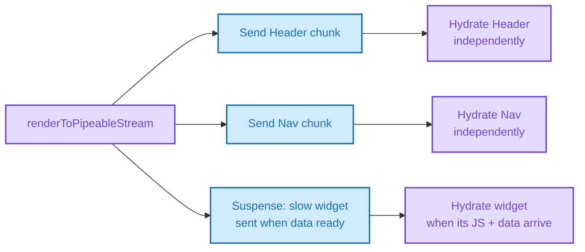

# 📖 The Definitive Guide to SSR + Hydration

> **The only architecture document you will ever need.**
> A masterclass on Server-Side Rendering and Hydration: from the request lifecycle and the reuse-not-rebuild mental model to every real-world hydration mismatch, streaming/selective hydration, and the resumability alternative. Written by Frontend Dev, for Frontend Dev.

[](https://example.com)
[](https://example.com)
[](https://example.com)

---

## 🧠 TL;DR (The 10-Second Mental Model)

If you forget everything else, remember this:

```text
CSR = Browser builds the page from an empty div (The Blank Canvas)
SSR = Server builds the page once, ships finished HTML (The Printed Page)
Hydration = Client re-attaches "life" to that printed page, without redrawing it
```

**🚨 The #1 Interview Trap:**
**SSR is NOT the same as Hydration.**
* **SSR** is a *rendering step* — running your component tree on the server to produce an HTML string.
* **Hydration** is a *separate, later step* — the client walking that already-existing HTML and wiring React's fiber tree + event listeners onto it.
* *You can SSR without ever hydrating (static HTML, zero interactivity). You cannot hydrate without something having been SSR'd (or SSG'd) first.*

**🚨 The #2 Interview Trap:**
**A hydration mismatch is not a rendering bug — it's a contract violation.** `hydrateRoot` isn't rendering fresh; it's *verifying* that the DOM already there matches what it expected. The moment server output and client's first-render output diverge, the contract breaks and React discards the mismatched subtree and rebuilds it client-side — silently paying the CSR cost you were trying to avoid.

---

## 📑 Table of Contents

- [1. The Core Mental Model: Printed Page, Not Blank Canvas](#1-the-core-mental-model-printed-page-not-blank-canvas)
- [2. The Absolute SSR Request Lifecycle](#2-the-absolute-ssr-request-lifecycle)
- [3. Hydration: The Attachment Mechanism](#3-hydration-the-attachment-mechanism)
- [4. The One Rule That Governs Every Hydration Bug](#4-the-one-rule-that-governs-every-hydration-bug)
- [5. Every Cause of a Hydration Mismatch (and the Fix)](#5-every-cause-of-a-hydration-mismatch-and-the-fix)
- [6. Debugging a Real Mismatch](#6-debugging-a-real-mismatch)
- [7. Streaming SSR & Selective Hydration](#7-streaming-ssr--selective-hydration)
- [8. Resumability: Skipping Hydration Entirely (Qwik)](#8-resumability-skipping-hydration-entirely-qwik)
- [9. SSR vs CSR vs SSG vs Resumability: The Ultimate Matrix](#9-ssr-vs-csr-vs-ssg-vs-resumability-the-ultimate-matrix)
- [10. Visual Architecture Map](#10-visual-architecture-map)
- [11. System Architecture Diagram](#11-system-architecture-diagram)
- [12. Interview Kill Shots](#12-interview-kill-shots)
- [13. Deep-Dive Reference Index](#13-deep-dive-reference-index)

---

## 1. The Core Mental Model: Printed Page, Not Blank Canvas

In pure CSR, the server hands the browser an empty shell:

```html
<div id="root"></div>
<script src="/bundle.js"></script>
```

The browser must download, parse, and execute the JS bundle before *anything* meaningful appears. Until then: blank screen.

SSR flips this. The server itself runs your component tree — `renderToString()` or the streaming variant, `renderToPipeableStream()` — producing a fully-formed HTML string, content already in it. That string ships to the browser immediately. The user sees real content on first paint, before a single byte of JS has downloaded.

**The Architect's Truth:** SSR doesn't make your app "server-driven" the way an MPA is — it just moves the *first* render to the server. Every render after that (state changes, interactions) still happens on the client, exactly like CSR. SSR only buys you the first paint.

**Why it's needed:**
* Faster perceived load — content visible before JS runs
* Better SEO — crawlers see real markup in the initial response, not an empty `<div>`
* Resilience on slow networks/low-power devices — something renders even if the JS bundle is still in flight

---

## 2. The Absolute SSR Request Lifecycle

What happens when a request hits an SSR server for `/dashboard`?

```text
[ URL Bar ] → DNS → TCP → TLS → HTTP Request
```

### The Server Gauntlet
1. **Route match:** map `/dashboard` → the right component tree
2. **Data fetch:** hit the DB/API for whatever `<Dashboard />` needs, *before* rendering
3. **Render:** `renderToString(<Dashboard data={data} />)` → HTML string
4. **Serialize state:** embed the fetched data into the HTML (`window.__INITIAL_DATA__ = {...}`) so the client doesn't have to re-fetch or guess it
5. **Compose:** inject the HTML string into the page shell, send the response

### The Client Gauntlet (after the HTML lands)
1. Browser paints the server HTML immediately — **this is the win SSR bought you**
2. Browser downloads the JS bundle in parallel/afterward
3. JS executes, framework boots
4. `hydrateRoot(container, <Dashboard data={window.__INITIAL_DATA__} />)` runs
5. React walks the existing DOM, verifies it matches, attaches listeners
6. Page becomes interactive

> **Architect's Note:** Between steps 1 and 6 on the client, the page *looks* done but isn't interactive yet — click a button and nothing happens. This gap is exactly what streaming and selective hydration (Section 7) exist to shrink.

---

## 3. Hydration: The Attachment Mechanism

Server-rendered HTML is static. No event listeners, no React fiber tree, no state — it's a picture of the UI, not the UI itself.

**Hydration** is the client-side step that brings it to life. Instead of tearing down the server's DOM and rebuilding from nothing (what `createRoot` does for CSR), `hydrateRoot` walks the *existing* DOM nodes and attaches React's internal tree + event listeners onto those same nodes — reuse, not rebuild.

```jsx
// Server (Node/Express)
import { renderToString } from 'react-dom/server';
const html = renderToString(<App message="Hello from server!" />);
// -> inject `html` into an HTML shell, send to browser

// Client
import { hydrateRoot } from 'react-dom/client';
hydrateRoot(document.getElementById('root'), <App message="Hello from server!" />);
```

| | Assumes | Use case |
| :--- | :--- | :--- |
| `createRoot` | DOM node is empty | CSR — builds tree from nothing |
| `hydrateRoot` | DOM node already has server-rendered HTML | SSR — reuses existing DOM |

**🚫 Stop Saying:** "Hydration re-renders the page."
**Architect's Truth:** Hydration doesn't render new DOM — it *attaches* to DOM that already exists. If it has to actually redraw something, that means the reuse contract already failed (Section 4).

---

## 4. The One Rule That Governs Every Hydration Bug

> The HTML the server rendered must match, node-for-node, what React would produce if it rendered the same component fresh on the client.

`hydrateRoot` is comparing the two, live. Any divergence is a **hydration mismatch**.

**Why not just re-render everything on the client and skip the comparison entirely?** Because that throws away the DOM the server already built (flicker, wasted work) and takes as long as plain CSR — defeating the entire point of paying for SSR in the first place. Hydration's whole job is *reuse*, not *rebuild*; the comparison is the mechanism, not an optional safety check.

---

## 5. Every Cause of a Hydration Mismatch (and the Fix)

### 5.1 Server and client passed different data/props
The most common bug in a hand-rolled (non-framework) SSR setup — you write both the `renderToString` call and the `hydrateRoot` call yourself, so it's easy to let them drift.

```jsx
// ❌ server.js
renderToString(<App message="Hello from server!" />);

// ❌ client.js
hydrateRoot(root, <App message="Hello from client!" />);
```

**Fix:** serialize the server's data into the HTML and have the client read the *same* value instead of hardcoding or re-deriving it:

```html
<script>window.__INITIAL_DATA__ = {"message": "Hello from server!"}</script>
```
```jsx
hydrateRoot(root, <App message={window.__INITIAL_DATA__.message} />);
```

### 5.2 Non-deterministic values rendered directly
`Math.random()`, `Date.now()`, `new Date().toString()` inside JSX — the server computes one value, the client computes a different one moments later.

**Fix:** don't compute in the render path. Start with a placeholder (`null`, or a server-safe default) and set the real value inside `useEffect` after mount.

### 5.3 Browser-only globals read during render
`window`, `document`, `localStorage`, `navigator` don't exist on the server. Reading them during render either crashes SSR outright (`ReferenceError: window is not defined`) or produces divergent output.

**Fix:** guard with `typeof window !== 'undefined'`, or move the read into `useEffect` / `useSyncExternalStore`.

### 5.4 Timezone / locale formatting differences
Server renders a date in UTC; client formats it in the visitor's local timezone. Both are "correct," but the text differs — and this can be subtler than it sounds, since ICU (locale data) revisions across Node/browser versions have introduced single-character mismatches (e.g. a narrow no-break space before AM/PM) that read as hydration errors.

**Fix:** render a fixed/ISO string on the server, convert to local/relative time only after hydration (inside an effect), or wrap the element in `suppressHydrationWarning` as a last resort for a single leaf node — never a whole subtree.

### 5.5 Invalid HTML nesting
`<div>` inside `<p>`, `<a>` inside `<a>`, block elements inside `<button>`. The browser silently "corrects" invalid HTML as it parses, so the DOM that actually lands differs from what React expected to find.

**Fix:** lint for valid nesting; use `<span>` instead of `<div>` inside text-level elements.

### 5.6 Conditional rendering based on client-only state
`window.innerWidth`, user-agent sniffing, `localStorage`-backed state (theme toggles, persisted stores) used directly in the render path. The server has no `window`, so it renders a different branch than the client does moments later.

**Fix:** keep the *first* render identical on both sides (a safe default), then switch branches inside `useEffect` once mounted.

### 5.7 Async data fetched differently on each side
Server fetches data at request time; client re-fetches independently on mount and gets a slightly different snapshot (an incremented counter, an updated "last modified" label).

**Fix:** pass the server's fetched data down as the client's initial state (the same `__INITIAL_DATA__` pattern as 5.1) instead of blindly re-fetching on the client.

### 5.8 Calling `root.render()` too early after `hydrateRoot`
A hand-rolled-React-specific gotcha: if you trigger a render on the root before hydration has finished, React logs:

> *"This root received an early update, before anything was able to hydrate. Switched the entire root to client rendering."*

React gives up on hydrating that subtree and force-switches it to plain CSR — you silently lose the SSR benefit for that part of the tree.

**Fix:** don't dispatch state updates or wrap in extra render calls immediately after `hydrateRoot`; let hydration complete first.

### 5.9 Third-party scripts / browser extensions mutating the DOM early
Password managers, ad blockers, and accessibility tools sometimes inject attributes into the DOM before React hydrates. React sees attributes it never rendered.

**Fix:** usually not your bug — confirm by testing in a clean browser profile with extensions disabled.

### 5.10 Incorrectly configured Edge/CDN rewriting the response
An edge layer (e.g. Cloudflare Auto Minify) rewriting whitespace or attributes in the HTML response after the server generated it, before the browser ever sees it.

**Fix:** disable HTML auto-minification/rewriting on SSR responses at the CDN layer, or verify the raw response bytes match what the server actually sent.

---

## 6. Debugging a Real Mismatch

React prints a diff (`+ Client` / `- Server`) pointing at the exact divergent element — read that first instead of guessing which of the causes above applies.

**Reproduce it yourself:**
```jsx
// server.js
const html = renderToString(<App message="Hello from server!" />);

// client.js
hydrateRoot(document.getElementById('root'), <App message="Hello from client!" />);
```
Run it, open the console, read the warning, then fix by making both sides pass the same message — via the `__INITIAL_DATA__` pattern from Section 5.1.

**🚫 Stop Saying:** "Just add `suppressHydrationWarning` and move on."
**Architect's Truth:** it silences the warning on one node; it does not sync the content. Treat it as a last resort for genuinely-expected-to-differ leaves (live timestamps), never as a general fix for a mismatch you haven't diagnosed.

---

## 7. Streaming SSR & Selective Hydration

`renderToString` blocks until the *entire* component tree has rendered before sending anything — one slow data dependency stalls the whole response.

`renderToPipeableStream` (React 18+) sends HTML in chunks as each part becomes ready. Combined with `<Suspense>` boundaries, it enables **selective hydration** — parts of the page can hydrate independently, in priority order, as their JS arrives and as the user interacts with them. A slow, data-dependent component no longer blocks the rest of the page from becoming interactive.

```text
renderToString:          [ Wait for everything ] ──▶ Send full HTML
renderToPipeableStream:  [ Send Header ] ──▶ [ Send Nav ] ──▶ [ Send slow widget when ready ]
```

This is what solved SSR's older "hydration is all-or-nothing" blocking problem — pre-React-18, one slow component could delay interactivity for the entire page.

---

## 8. Resumability: Skipping Hydration Entirely (Qwik)

Hydration re-executes your whole component tree on the client just to attach event listeners — expensive even when the HTML was already 100% correct and no mismatch occurred at all. That's a real cost paid on *every* SSR page load, mismatch or not.

**Resumable** frameworks (Qwik being the clearest example) take a different approach: serialize the application's execution state directly into the HTML itself, so the client can "resume" exactly where the server left off and attach a single event listener to a single button — without re-running the rest of the app's component tree at all.

```text
Hydration model:    Server renders → Client re-executes entire tree → Listeners attached
Resumable model:    Server renders + serializes state → Client resumes one listener, on demand
```

Still a minority pattern in production as of 2026, but it's the clearest signal of where hydration's fundamental cost is pushing framework design — treat it as the "where this is headed" answer in an interview, not the default recommendation today.

---

## 9. SSR vs CSR vs SSG vs Resumability: The Ultimate Matrix

| Feature | CSR | SSR + Hydration | SSG (Static) | Resumable (Qwik) |
| :--- | :--- | :--- | :--- | :--- |
| **First paint** | Slow (blank until JS runs) | Fast (HTML ships pre-built) | Fastest (pre-built at build time) | Fast (HTML ships pre-built) |
| **Time to Interactive** | Tied to JS download/parse | Tied to JS download + hydration | Tied to JS download + hydration | Near-instant (no re-execution) |
| **SEO** | Poor without workarounds | Native — full HTML in first response | Native — full HTML in first response | Native — full HTML in first response |
| **Data freshness** | Always fresh (client fetch) | Fresh per-request | Stale until rebuild (or ISR) | Fresh per-request |
| **Server cost per request** | None (static shell only) | High (renders on every request) | None (pre-built) | High (renders on every request) |
| **Client JS cost** | Full app bundle | Full app bundle, re-executed | Full app bundle, re-executed | Only the listeners actually needed |
| **Best for** | Internal tools, dashboards behind auth | Content that changes per-request/user | Blogs, docs, marketing pages | Content-heavy, interactivity-sparse apps |

---

## 10. Visual Architecture Map

### A. The SSR + Hydration Request Flow


### B. Hydration Match vs Mismatch


### C. Streaming SSR + Selective Hydration


### 📝 Core SSR + Hydration Summary Notes
> * SSR only changes *where the first render happens* — every render after that is still client-side, same as CSR.
> * Hydration attaches to existing DOM; it does not redraw it. If it redraws, the reuse contract already failed.
> * Every mismatch traces back to one rule: server output and client's first-render output must be identical.
> * Streaming + selective hydration exist because `renderToString`/full-tree hydration are both all-or-nothing.
> * Resumability (Qwik) is the answer to hydration's cost existing *even when there's no mismatch at all*.

---

## 11. System Architecture Diagram

A production-ready SSR + Hydration infrastructure:

```text
                         ┌──────────────┐
                         │   BROWSER    │
                         │ (Paint → Hydrate → Interactive)
                         └──────┬───────┘
                                │
                      1. GET /dashboard
                      2. Receive streamed/complete HTML
                      3. Download JS bundle (parallel)
                                │
                         ┌──────▼───────┐
                         │ CDN / Edge   │ ◄── Caches static JS/CSS; SSR HTML
                         └──────┬───────┘     typically bypasses cache (per-request)
                                │
                     ┌──────────▼──────────┐
                     │ SSR Render Server   │ ◄── renderToString /
                     │ (Node/Express/Next) │     renderToPipeableStream
                     └──────────┬──────────┘
                                │
                  ┌─────────────┼─────────────┐
                  │             │             │
             ┌────▼────┐  ┌────▼────┐  ┌────▼────┐
             │ Redis   │  │ API /   │  │ Database│
             │ (Cache) │  │ Services│  │ (SQL)   │
             └─────────┘  └─────────┘  └─────────┘
```

---

## 12. Interview Kill Shots

**Q: "Why is my SSR page fast to paint but slow to become interactive?"**
> *"SSR only front-loads the first render — the HTML paints immediately, but the page isn't interactive until the JS bundle downloads and hydration finishes attaching listeners. That gap is exactly what streaming SSR + selective hydration shrink, by hydrating high-priority parts of the page independently instead of waiting for the whole tree."*

**Q: "What causes a hydration mismatch?"**
> *"Anything that makes the client's first render differ from what the server actually sent — different props between the server and client calls, non-deterministic values like `Math.random()` or `Date.now()` rendered directly, browser-only globals read during render, invalid HTML nesting, or client-only conditional branches. The fix pattern is always the same: make the inputs to both renders identical."*

**Q: "Is hydration expensive even without a mismatch?"**
> *"Yes — that's the part people miss. Hydration re-executes the component tree on the client just to attach event listeners, even when the HTML was already correct. That fixed cost is exactly what resumable frameworks like Qwik are designed to eliminate, by serializing execution state into the HTML so the client resumes instead of re-running."*

**Q: "How would you debug a hydration warning in production?"**
> *"Read React's own diff first — it shows `+ Client` / `- Server` on the exact divergent node, so you don't need to guess. Then map it to a known cause: mismatched props, a non-deterministic value, a browser-only API read during render, or an edge/CDN layer rewriting the HTML response before it reached the browser."*

**Q: "When would you reach for `suppressHydrationWarning`?"**
> *"Only on a single leaf node where the divergence is expected and harmless — a live 'time ago' timestamp, for example. It silences the warning, it doesn't sync the content, so it's never a fix for a mismatch you haven't actually diagnosed."*

**Q: "SSR vs SSG — when do you pick which?"**
> *"SSG pre-builds HTML at build time — fastest possible first paint, zero per-request server cost, but data goes stale until the next rebuild (or you add ISR). SSR renders fresh on every request — same first-paint benefit, but you pay a server cost per request in exchange for always-current data. Pick SSR when the response genuinely depends on the request (auth, personalization, real-time data); pick SSG when it doesn't."*

---

## 13. Deep-Dive Reference Index

*Curated primary sources for deep reading:*
* [react.dev — hydrateRoot](https://react.dev/reference/react-dom/client/hydrateRoot)
* [react.dev — renderToPipeableStream](https://react.dev/reference/react-dom/server/renderToPipeableStream)
* [Next.js — Text content does not match server-rendered HTML](https://nextjs.org/docs/messages/react-hydration-error)
* [React Working Group — Streaming SSR & Selective Hydration](https://github.com/reactwg/react-18/discussions/37)
* Video: *How React SSR Actually Works (Without Frameworks)* — https://www.youtube.com/watch?v=clANSXTNZ1Q
* [Qwik Docs — Resumability](https://qwik.dev/docs/concepts/resumable/)

---

**⭐ Star this repository if it helped you crack your system design or frontend architecture interview!**
