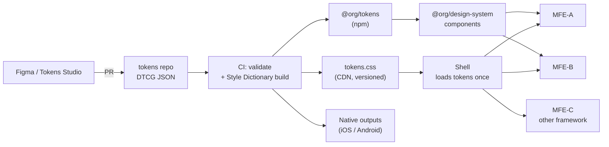

# 🎨 Design System Boundaries + Design Tokens: The Definitive In-Depth Guide

> **Context:** For frontend architects and platform teams running a shared design system across many apps, especially micro-frontend (MFE) setups like Single-SPA or Module Federation. It answers two questions: **where does the design system end and the product begin (boundaries)?** and **how do visual decisions travel from Figma to every runtime (tokens)?**

---

## 🧠 TL;DR (The 10-Second Mental Model)

```text
Tokens      = the DECISIONS   (color, space, type, motion)   → data
Components  = the IMPLEMENTATION of decisions                 → code
Patterns    = the COMPOSITION of components for a use case    → product-owned
Boundary    = the line that says who owns which of the above
```

**🚨 The #1 Trap:** teams treat the design system as "a component library." It is not. The **tokens are the contract**; components are just one consumer of that contract. In an MFE world, tokens are the *only* thing you can safely share at runtime without version coupling.

---

## 📑 Table of Contents

- [Part 1: Design System Boundaries](#part-1-design-system-boundaries)
  - [1. The Layered Model](#1-the-layered-model)
  - [2. What the Design System Owns vs. What Products Own](#2-what-the-design-system-owns-vs-what-products-own)
  - [3. The Boundary Test (Decision Framework)](#3-the-boundary-test-decision-framework)
  - [4. Governance Models](#4-governance-models)
  - [5. Versioning & Breaking Changes](#5-versioning--breaking-changes)
  - [6. Boundaries in Micro-Frontends](#6-boundaries-in-micro-frontends)
  - [7. Boundary Anti-Patterns](#7-boundary-anti-patterns)
- [Part 2: Design Tokens](#part-2-design-tokens)
  - [8. What a Token Actually Is](#8-what-a-token-actually-is)
  - [9. The Three-Tier Token Architecture](#9-the-three-tier-token-architecture)
  - [10. Naming Conventions](#10-naming-conventions)
  - [11. The DTCG Standard (2025.10)](#11-the-dtcg-standard-202510)
  - [12. The Token Pipeline](#12-the-token-pipeline)
  - [13. Theming, Modes & Multi-Brand](#13-theming-modes--multi-brand)
  - [14. Delivering Tokens to the Browser](#14-delivering-tokens-to-the-browser)
  - [15. Token Anti-Patterns](#15-token-anti-patterns)
- [Part 3: Putting It Together](#part-3-putting-it-together)
  - [16. Reference Architecture](#16-reference-architecture)
  - [17. Testing & Enforcement](#17-testing--enforcement)
  - [18. Adoption Roadmap](#18-adoption-roadmap)
  - [19. Interview Kill Shots](#19-interview-kill-shots)
  - [20. Deep-Dive Reference Index](#20-deep-dive-reference-index)

---

# Part 1: Design System Boundaries

## 1. The Layered Model

Think of the system as concentric layers. Each outer layer may depend on inner layers, **never the reverse**.

```text
┌───────────────────────────────────────────────────────────┐
│  PRODUCT / FEATURE LAYER        (owned by product teams)  │
│  Screens, flows, domain widgets (GradebookTable, LessonCard)│
│  ┌─────────────────────────────────────────────────────┐  │
│  │  PATTERN LAYER              (shared, guidance-heavy) │  │
│  │  Forms, empty states, page layouts, data-table shell │  │
│  │  ┌───────────────────────────────────────────────┐  │  │
│  │  │  COMPONENT LAYER          (design system owns) │  │  │
│  │  │  Button, Input, Modal, Tabs, Tooltip           │  │  │
│  │  │  ┌─────────────────────────────────────────┐  │  │  │
│  │  │  │  TOKEN LAYER            (design system) │  │  │  │
│  │  │  │  color · space · type · radius · motion │  │  │  │
│  │  │  └─────────────────────────────────────────┘  │  │  │
│  │  └───────────────────────────────────────────────┘  │  │
│  └─────────────────────────────────────────────────────┘  │
└───────────────────────────────────────────────────────────┘
```

| Layer | Question it answers | Change frequency | Blast radius of a change |
|---|---|---|---|
| **Tokens** | "What does our brand look/feel like?" | Low | Everything |
| **Components** | "How do we build a primitive UI element?" | Medium | All consumers of that component |
| **Patterns** | "How do we solve this recurring UX problem?" | Medium | Teams that adopted the pattern |
| **Product** | "What does *this feature* do?" | High | One feature |

**Rule of thumb:** the lower the layer, the slower it should change and the more carefully it should be reviewed.

---

## 2. What the Design System Owns vs. What Products Own

| Concern | Design system owns | Product team owns |
|---|---|---|
| Color, spacing, type, radius, elevation, motion values | ✅ (tokens) | ❌ Consumes only |
| Primitive components (Button, Input, Select, Dialog) | ✅ | ❌ Composes, doesn't fork |
| Accessibility of primitives (focus, ARIA, keyboard) | ✅ | ❌ Inherits |
| Layout primitives (Stack, Grid, Container) | ✅ | ❌ |
| Domain components (`StudentRosterRow`, `AssignmentCard`) | ❌ | ✅ |
| Business logic, data fetching, routing | ❌ | ✅ |
| Page/screen composition | ❌ | ✅ |
| Content, copy, i18n strings | ❌ | ✅ (DS provides i18n *hooks*) |
| Analytics events | ❌ | ✅ (DS may expose callback props) |
| Feature-specific overrides | ❌ | ✅ via sanctioned extension points only |

**The graduation path:** a product-specific component that gets reused by 3+ teams is a *candidate* for promotion into the design system. Promotion is a deliberate decision, not a copy-paste.

```text
Product-local  →  Shared in product family  →  Proposed to DS  →  Adopted in DS
   (1 team)            (2 teams)                (RFC + design)       (versioned, documented)
```

---

## 3. The Boundary Test (Decision Framework)

Before adding anything to the design system, run it through these questions. A "no" to any of the first three usually means *keep it in the product layer*.

1. **Reusable?** Will 3+ independent teams use it in the same form?
2. **Domain-free?** Can you describe it without mentioning your business domain?
3. **Stable?** Is the design settled, or still being explored?
4. **Ownable?** Does the DS team have capacity to maintain, document, and support it?
5. **Accessible?** Can the DS guarantee a11y behavior for it centrally?

```text
                 ┌─ No ──→ Keep in product layer
Reusable by 3+? ─┤
                 └─ Yes ─→ Domain-free? ─ No ──→ Shared "domain kit" (not core DS)
                                   │
                                   └ Yes ─→ Stable design? ─ No ──→ Incubate in product; revisit
                                                  │
                                                  └ Yes ─→ ADD to design system
```

> 💡 **The "Rule of Three":** don't abstract until you've seen three real, slightly different uses. Premature promotion produces components with 30 props and no clear purpose.

---

## 4. Governance Models

Who decides what goes in? Three common models:

| Model | How it works | Pros ✅ | Cons ❌ | Best for |
|---|---|---|---|---|
| **Centralized** | A dedicated DS team owns everything | Consistency, quality | Bottleneck; teams feel blocked | Small orgs, early-stage DS |
| **Federated** | Product teams contribute; a core team curates | Scales; buy-in | Needs strong review process | Mid/large orgs with many teams |
| **Hybrid ("core + contribution")** | Core team owns tokens + primitives; product teams own patterns and can contribute via RFC | Balance of speed and control | Requires clear contribution guidelines | Large multi-team / MFE orgs |

### What a healthy contribution process looks like
```text
Idea → Issue/RFC → Design review (a11y, tokens, variants) → Build in DS repo
     → Visual + a11y tests → Docs + usage guidance → Release (semver) → Announce
```

**Non-negotiables regardless of model:** a public roadmap, a documented deprecation policy, an SLA for bug fixes, and a named owner for every component.

---

## 5. Versioning & Breaking Changes

The design system is a **dependency**; treat it like a public API.

### Semantic versioning, applied to design systems

| Change | Semver | Example |
|---|---|---|
| Visual tweak to a token value (color shade) | **Minor or Major**, depends on org policy | `blue-600` shifts slightly |
| New component / new token | Minor | Add `Tooltip` |
| Bug fix | Patch | Fix focus ring on `Select` |
| Removing/renaming a prop, token, or component | **Major** | `variant="primary"` → `variant="brand"` |
| Changing component DOM structure (breaks CSS overrides/tests) | **Major** | Wrapper `div` removed |

> ⚠️ **The hidden breaking change:** changing a *token value* can visually break every consumer without a single API change. Decide up front whether value changes are minor (opt-in via a new version) or major, and communicate it.

### Deprecation lifecycle
```text
Announce (docs + changelog)
   ↓  ≥ 1–2 minor releases
Warn at runtime (console.warn in dev only)
   ↓
Provide codemod (automated migration)
   ↓
Remove in next major
```

**Codemods are the force multiplier.** With 30+ consumer apps, a `jscodeshift`/`ts-morph` codemod turns a multi-quarter migration into a one-week rollout.

---

## 6. Boundaries in Micro-Frontends

This is where boundaries get genuinely hard. In an MFE architecture the design system is the **one shared thing** that touches every independently deployed app.

### The core tension
```text
Independent deployability  ⟷  Visual & behavioral consistency
```

If every MFE bundles its own copy of the component library at a different version, you get inconsistent UI and duplicated bytes. If you force a single shared version, you reintroduce deployment coupling.

### Three delivery strategies for the component layer

| Strategy | How | Pros ✅ | Cons ❌ |
|---|---|---|---|
| **A. Build-time npm dependency per MFE** | Each MFE installs `@org/ds@x.y.z` and bundles it | Simple; no runtime coupling; type-safe | Version drift across MFEs; duplicated bytes; slow to roll out a fix |
| **B. Shared runtime singleton** | DS loaded once via import map / Module Federation `shared` (`singleton: true`) | One copy; instant org-wide fixes; smaller total payload | Breaking changes hit all MFEs at once; needs strict semver + compat window |
| **C. Hybrid: tokens shared at runtime, components pinned at build time** | CSS variables/tokens served once by the shell; components bundled per MFE | Visual consistency *and* independent component upgrades | Components and tokens must stay compatible across a version range |

**Most large MFE orgs land on C (or B for a stable core).** Reasoning: tokens change rarely and are pure data (safe to share), while component APIs change more often (risky to force-share).

### Why tokens are the ideal shared runtime contract
* They are **plain data** (CSS custom properties): no framework, no version-skew crash like `Invalid hook call`.
* CSS variables **cross the whole document** and even pierce Shadow DOM boundaries (custom properties inherit into shadow trees).
* A token change (re-brand, dark mode, high-contrast) propagates to *every* MFE **without redeploying any of them**.

```text
Shell (root-config)
 ├─ loads tokens.css once  ──►  :root { --color-bg-surface: ...; --space-4: ...; }
 │
 ├─ MFE-A (React 18, DS v3.2 bundled)  ─┐
 ├─ MFE-B (React 18, DS v3.4 bundled)  ─┼─►  all read the same CSS variables
 └─ MFE-C (Angular, own components)    ─┘     (consistent look, independent code)
```

### MFE-specific boundary rules
1. **The shell owns the token stylesheet** and theme switching (`data-theme` attribute on `<html>`). MFEs must never redefine global tokens.
2. **MFEs consume semantic tokens only** (never raw palette values), so re-theming works.
3. **CSS isolation:** namespace or scope component styles (CSS Modules, `@layer`, or Shadow DOM) so one MFE's styles can't leak into another.
4. **Shared React/DS singleton discipline:** if the component library is a singleton, pin a compatibility range (e.g., `^3.0.0`) and run **cross-MFE contract tests** before any DS major.
5. **Cross-framework MFEs (React + Angular + Vue):** tokens are the *only* practical way to keep them visually aligned; consider Web Components for a few primitives if you truly need shared behavior.
6. **Global overlays (modals, toasts, tooltips):** mount portals into a shell-owned container so z-index and stacking are governed by tokens (`--z-modal`), not by whichever MFE loaded last.

```text
Z-index token scale (owned by DS, applied via shell container):
  --z-base: 0 | --z-dropdown: 1000 | --z-sticky: 1100 | --z-modal: 1300 | --z-toast: 1500
```

---

## 7. Boundary Anti-Patterns

| Anti-pattern | Symptom | Fix |
|---|---|---|
| **The Kitchen Sink** | DS contains domain-specific widgets, 50-prop components | Apply the Boundary Test; move domain code to product/domain kits |
| **Fork-and-Drift** | Teams copy a component and tweak it locally | Provide sanctioned extension points (slots, `className`, tokens); track forks in a dashboard |
| **Override Wars** | Consumers use `!important` / deep selectors on DS internals | Expose proper variants/props; treat internal DOM as private API |
| **The Bottleneck Team** | Every change waits on 2 DS engineers | Move to federated/hybrid governance; inner-source contributions |
| **Ivory Tower** | DS built without product input; low adoption | Embed DS engineers in product teams; adoption metrics; office hours |
| **Token Bypass** | Hard-coded `#3366ff` and `16px` in product code | Lint rules (see §17); codemods; visible token coverage metric |
| **Version Roulette** | 30 apps on 12 different DS versions | Compatibility window policy; automated upgrade PRs (Renovate/Dependabot) |
| **Big-Bang Rebrand** | Token values baked into components, rebrand = rewrite | Semantic token layer; theme via CSS variables |

---

# Part 2: Design Tokens

## 8. What a Token Actually Is

A **design token** is a named, platform-agnostic design decision: the smallest indivisible unit of a visual style.

```text
Hard-coded:   background: #1a56db;
Tokenized:    background: var(--color-action-primary-bg);
                                  └── name carries INTENT, value can change freely
```

Tokens were popularized by Salesforce's design system team, and the name comes from them.

### Why tokens exist
* **Single source of truth:** one definition feeds web, iOS, Android, email, and design tools.
* **Change once, propagate everywhere:** re-brand or add dark mode without touching component code.
* **Shared language:** designers and developers say `color.text.muted` instead of "that light gray."
* **Enforceable:** you can lint for raw values; you can't lint for "looks right."

### Token categories

| Category | Examples | Typical CSS output |
|---|---|---|
| Color | `color.brand.500`, `color.text.primary` | `--color-text-primary` |
| Spacing | `space.1` … `space.12` | `--space-4: 1rem` |
| Typography | font family, size, weight, line-height, letter-spacing | `--font-size-body` |
| Sizing | icon sizes, control heights, container widths | `--size-icon-md` |
| Radius | `radius.sm/md/lg/full` | `--radius-md` |
| Border | width, style | `--border-width-1` |
| Shadow / Elevation | `shadow.sm/md/lg` | `--shadow-md` |
| Motion | duration, easing | `--duration-fast`, `--ease-standard` |
| Opacity | `opacity.disabled` | `--opacity-disabled` |
| Z-index | layering scale | `--z-modal` |
| Breakpoints | `bp.sm/md/lg` | used in build/tooling (media queries can't use `var()`) |

---

## 9. The Three-Tier Token Architecture

The single most important idea in token design: **separate raw values from meaning from usage.**

```text
TIER 1: PRIMITIVE (a.k.a. global / reference / core)
        "What values exist?"          color.blue.600 = #1a56db
                │  referenced by
                ▼
TIER 2: SEMANTIC (a.k.a. alias / system)
        "What do they MEAN?"          color.action.primary = {color.blue.600}
                │  referenced by
                ▼
TIER 3: COMPONENT (a.k.a. specific)
        "Where are they USED?"        button.primary.bg = {color.action.primary}
```

### Example (DTCG JSON)
```json
{
  "color": {
    "blue": {
      "600": { "$type": "color", "$value": { "colorSpace": "srgb", "components": [0.102, 0.337, 0.859] } }
    },
    "action": {
      "primary": { "$type": "color", "$value": "{color.blue.600}" }
    }
  },
  "button": {
    "primary": {
      "bg": { "$type": "color", "$value": "{color.action.primary}" }
    }
  }
}
```

### Who uses which tier?

| Tier | Used by | Rule |
|---|---|---|
| **Primitive** | Only the semantic tier | Products/components **never** reference primitives directly |
| **Semantic** | Components **and** product code | The main public API of the token system |
| **Component** | The component's own styles | Optional; add only when a component needs its own override hook |

### Why three tiers?
* **Re-theming:** dark mode remaps *semantic* tokens to different *primitives*. Component code doesn't change.
* **Multi-brand:** swap the primitive set; semantics stay identical.
* **Safe refactors:** rename a primitive without touching a single component.

### When to skip Tier 3
Component tokens add power *and* maintenance cost. Start with two tiers (primitive + semantic). Add component tokens only when (a) a component needs per-theme overrides that semantics can't express, or (b) you're shipping a white-label product where customers restyle individual components.

---

## 10. Naming Conventions

Names are the API. Get them right early: renames are breaking changes.

### Recommended structure
```text
{category}.{property}.{role}.{variant}.{state}

color.text.primary
color.text.muted
color.bg.surface
color.bg.surface.hover
color.border.focus
color.action.primary.bg.pressed
space.inset.md
font.size.body
```

### Principles
1. **Name by intent, not by value.**  ✅ `color.text.danger` ❌ `color.red`
2. **Consistent ordering** (general → specific), so autocomplete groups related tokens.
3. **Scales use ordinal or t-shirt sizes**, not pixel values: `space.4`, `radius.md`. (Pixel values in names break the moment the value changes.)
4. **States are suffixes:** `.hover`, `.pressed`, `.disabled`, `.focus`.
5. **Avoid encoding the mode:** ✅ `color.bg.surface` ❌ `color.bg.surface.dark` (the *mode* changes the value, not the name).
6. **Avoid abbreviations that aren't universal.** Optimize for readability over brevity.
7. **One concept, one name** across platforms (CSS `--color-text-primary`, Android `colorTextPrimary`, iOS `colorTextPrimary`), generated from the same source.

### Output naming per platform (generated, not hand-written)
```text
Source:  color.text.primary
CSS:     --color-text-primary
SCSS:    $color-text-primary
JS/TS:   tokens.color.text.primary
Swift:   Color.textPrimary
Android: color_text_primary
```

---

## 11. The DTCG Standard (2025.10)

For years, every tool exported tokens in its own JSON shape. That changed on **October 28, 2025**, when the **Design Tokens Community Group (DTCG)** published the first stable version of the Design Tokens specification, **2025.10**.

### Status: what "stable" does and doesn't mean
* ✅ The core **format** is stable and safe for production. It is a vendor-neutral JSON shape.
* ⚠️ The DTCG spec is **not a W3C Standard and not on the W3C Standards Track**; it is a Community Group report. Avoid calling it "the W3C standard" in formal docs.
* ⚠️ It is still evolving; build with flexibility for spec changes.
* Support spans Figma, Penpot, Sketch, Framer, Tokens Studio, Style Dictionary, Terrazzo, zeroheight, Supernova, and Knapsack (varying degrees of completeness).

### The format in 30 seconds
Every token has `$value` and (usually) `$type`. Tokens can reference other tokens with `{path.to.token}`. Groups nest arbitrarily.

```json
{
  "$schema": "https://www.designtokens.org/schemas/2025.10/format.json",
  "space": {
    "$type": "dimension",
    "4": { "$value": { "value": 16, "unit": "px" } }
  },
  "color": {
    "text": {
      "primary": {
        "$type": "color",
        "$value": { "colorSpace": "srgb", "components": [0.07, 0.09, 0.15], "alpha": 1 },
        "$description": "Default body text on surface backgrounds"
      }
    }
  },
  "duration": {
    "fast": { "$type": "duration", "$value": { "value": 150, "unit": "ms" } }
  }
}
```

### What 2025.10 changed vs. the old draft
| Area | Now |
|---|---|
| **Color** | Structured object (`colorSpace`, `components`, `alpha`, optional `hex` fallback). Supports modern spaces (Display-P3, OKLCH, OKLab, etc.), not just sRGB hex |
| **Dimension / Duration** | Object values with explicit `value` + `unit` (older string form like `"16px"` still appears in the wild and is handled by tools for backward compatibility) |
| **Composite types** | typography, border, shadow, gradient, transition, etc. |
| **Extensions** | `$extensions` lets tools keep vendor-specific data without breaking the standard |
| **Theming** | A separate **Resolver Module** describes multi-context tokens (light/dark, brands) and aims to avoid combinatorial file explosion |

> ⚠️ **Resolver caveat:** the Resolver Module is part of the 2025.10 release but tool support is still catching up. Verify your toolchain's coverage before depending on resolver-based merging in production.

### Should you migrate to DTCG?
| Situation | Recommendation |
|---|---|
| New design system | **Start on DTCG.** No legacy to carry |
| Existing Style Dictionary v3 tokens | Migrate: SD provides a converter for `value/type/description` → `$value/$type/$description` |
| Heavy custom tooling around a proprietary format | Plan a phased migration; write an adapter first |
| Only ever targeting one platform, one tool | Lower urgency, but you still gain future tool interoperability |

---

## 12. The Token Pipeline

Tokens are **authored once, transformed per platform, and distributed as versioned packages.**

```text
   AUTHORING                 TRANSFORM                  OUTPUTS                    CONSUMERS
┌────────────────┐     ┌──────────────────┐     ┌─────────────────────┐     ┌────────────────┐
│ Figma Variables│     │                  │     │ tokens.css (vars)   │────►│ Web (all MFEs) │
│ Tokens Studio  │────►│  Style Dictionary│────►│ tokens.ts (typed)   │────►│ TS/React code  │
│ or JSON in Git │     │  (v5) / Terrazzo │     │ tokens.scss         │────►│ Sass apps      │
│ (DTCG format)  │     │  + custom        │     │ Tokens.swift        │────►│ iOS            │
└────────────────┘     │  transforms      │     │ tokens.xml / Compose│────►│ Android        │
        ▲              └──────────────────┘     │ tailwind preset     │────►│ Tailwind users │
        │                                       └─────────────────────┘     └────────────────┘
        │                        │
        └── PR review ◄──────────┘   CI: validate schema → build → test → publish (semver)
```

### Source of truth: Figma or Git?

| Approach | Pros ✅ | Cons ❌ |
|---|---|---|
| **Figma is source** (Variables → export/sync) | Designers self-serve; fast iteration | Code review of design changes is weak; Figma plan limits on some export APIs |
| **Git JSON is source** (Tokens Studio or hand-edited) | Full PR review, history, CI validation | Designers need a tooling bridge |
| **Bidirectional sync** | Best of both | Most complex; conflict resolution needed |

**Pragmatic recommendation:** treat **Git as the source of truth** and give designers a friendly editing surface (Tokens Studio or Figma Variables synced via PR). Every token change should be reviewable, diffable, and revertible.

### Style Dictionary (v5) essentials
* Build system for cross-platform styles; supports the DTCG format as its base.
* Recent 5.x releases handle DTCG 2025.10 dimension object values and DTCG color objects across all 14 defined color spaces, plus an `oklch` color transform.
* **Caveat:** full coverage of every 2025.10 feature (notably the resolver module) is still in progress, so check release notes before adopting new spec features.
* Keep it **pinned and updated**: it is a build-time dependency in your supply chain (e.g., a prototype-pollution fix shipped in a 5.4.x patch), so treat it like any other dependency for security updates.

```javascript
// style-dictionary.config.js (illustrative)
export default {
  source: ['tokens/**/*.json'],
  platforms: {
    css: {
      transformGroup: 'css',
      buildPath: 'dist/css/',
      files: [{
        destination: 'tokens.css',
        format: 'css/variables',
        options: { outputReferences: true }   // keeps var(--x) chains → runtime theming works
      }]
    },
    ts: {
      transformGroup: 'js',
      buildPath: 'dist/ts/',
      files: [{ destination: 'tokens.ts', format: 'javascript/es6' }]
    }
  }
};
```

> 💡 **`outputReferences: true` matters.** It emits `--color-action-primary: var(--color-blue-600)` instead of a flattened hex. That preserves the alias chain in the browser so you can remap a *semantic* variable under `[data-theme="dark"]` at runtime.

### Build-time transforms you'll actually need
| Transform | Why |
|---|---|
| px → rem | Respect user font-size settings (accessibility) |
| Color → OKLCH / hex fallback | Modern gamut + safe fallback |
| Name casing per platform | `kebab-case` (CSS) vs `camelCase` (JS/Swift) |
| Composite → CSS shorthand | typography/shadow/border tokens into single declarations |
| Attribute enrichment | Add `category`/`type` metadata used by docs |

---

## 13. Theming, Modes & Multi-Brand

### Vocabulary
* **Mode:** a variant of the *same* brand (light, dark, high-contrast).
* **Theme:** a full visual identity (may include modes).
* **Brand:** a different company/product identity sharing the same components (white-label).

### The mechanism: remap semantic tokens
```css
/* Primitives never change across modes */
:root {
  --color-neutral-0:   #ffffff;
  --color-neutral-900: #0b1220;
  --color-blue-600:    #1a56db;
  --color-blue-400:    #60a5fa;
}

/* Semantics point at different primitives per mode */
:root, [data-theme="light"] {
  --color-bg-surface:  var(--color-neutral-0);
  --color-text-primary: var(--color-neutral-900);
  --color-action-primary: var(--color-blue-600);
}
[data-theme="dark"] {
  --color-bg-surface:  var(--color-neutral-900);
  --color-text-primary: var(--color-neutral-0);
  --color-action-primary: var(--color-blue-400);   /* lighter blue for contrast on dark */
}
```

### System-preference handling
```css
/* Follow OS by default, allow explicit user override via [data-theme] */
:root { color-scheme: light dark; }

@media (prefers-color-scheme: dark) {
  :root:not([data-theme="light"]) { /* dark semantic values */ }
}

/* light-dark() shorthand: one declaration, both modes (modern browsers) */
.card { background: light-dark(var(--color-neutral-0), var(--color-neutral-900)); }
```

### Theming layers
```text
Base tokens        (always loaded)
   + Mode overrides    (light/dark/high-contrast)
      + Brand overrides    (white-label customer A / B)
         + Density overrides   (compact / comfortable: remap space & size tokens)
```

Avoid the **combinatorial explosion** (3 brands × 3 modes × 2 densities = 18 files) by composing layers at build or runtime instead of authoring every combination. This is exactly the problem the DTCG Resolver Module targets.

### Accessibility is a token concern
* Encode **contrast-safe pairings** as semantic tokens (`color.text.on-action`), so a designer can't pair a failing foreground/background by accident.
* Target **WCAG 2.2 AA** contrast ratios at minimum; validate every semantic text/background pair *per mode* in CI.
* Provide a **high-contrast** and **reduced-motion** mode: `@media (prefers-reduced-motion: reduce)` should collapse `--duration-*` tokens toward zero.
* Token-driven **focus ring** (`--color-border-focus`, `--focus-ring-width`) ensures a consistent, visible focus state everywhere.

---

## 14. Delivering Tokens to the Browser

### Option 1: CSS custom properties (recommended default)
```text
✅ Runtime theming (no rebuild)      ✅ Works across frameworks
✅ Crosses Shadow DOM boundaries     ✅ Devtools-debuggable
✅ Zero JS cost                       ⚠️ Can't be used in media-query conditions
```

### Option 2: Typed JS/TS constants
Use for: charts, canvas, animation libraries, CSS-in-JS, and anywhere JS needs the value.
```typescript
import { tokens } from '@org/tokens';
const barColor = tokens.color.chart.series1;       // typed, autocompleted
```
⚠️ Baked at build time: no runtime theme switching unless you read `getComputedStyle` for the variable.

### Option 3: Tailwind preset / theme config
Generate a Tailwind theme from tokens so utility classes (`bg-surface`, `text-primary`) map to semantic variables, not raw values.

### Option 4: Native platforms
Style Dictionary emits Swift, Android XML/Compose, and Flutter outputs from the same source.

### Registering typed variables with `@property`
```css
@property --space-4 {
  syntax: '<length>';
  inherits: true;
  initial-value: 1rem;
}
```
Benefits: type validation, animatable custom properties, and a safe fallback if the variable is missing.

### Loading strategy in an MFE shell
```text
1. Shell <head> includes tokens.css (render-blocking, cached, tiny)   ← avoids FOUC / theme flash
2. Inline a tiny script that sets data-theme BEFORE first paint (from cookie/localStorage/OS)
3. MFEs load later and inherit variables, no per-MFE token CSS
4. Version the token file in the URL (tokens.v4.2.0.css) + long cache; import map/manifest points to current
```

⚠️ **Avoid the theme flash:** if you set `data-theme` after hydration, users see a light flash before dark mode applies. Set it in a synchronous inline script in `<head>`.

### Cascade Layers to tame specificity wars
```css
@layer reset, tokens, ds-components, product;
/* Product styles in the last layer always win over DS defaults,
   without !important or specificity hacks. */
```

---

## 15. Token Anti-Patterns

| Anti-pattern | Why it hurts | Fix |
|---|---|---|
| **Naming by value** (`color.blue`, `space.16`) | Rename/rebrand breaks everything | Name by intent (`color.action.primary`) |
| **Skipping the semantic tier** | Components reference primitives; theming = rewrite | Enforce primitive → semantic → component |
| **Token explosion** (thousands of one-off tokens) | Unmaintainable; nobody knows which to use | Add tokens only when ≥2 uses need them; prune quarterly |
| **Too few tokens** (only a color palette) | Devs still hard-code spacing/type/motion | Cover all visual dimensions |
| **Mode in the name** (`bg.surface.dark`) | Forces consumers to branch on mode | Same name, different value per mode |
| **Tokens without documentation** | Misuse ("which gray is for borders?") | `$description` on every semantic token + a docs site |
| **Hand-editing generated files** | Drift between platforms | Generated outputs are read-only; edit the source |
| **No CI validation** | Broken references, missing contrast, invalid values ship | Schema + reference + contrast checks in CI |
| **Breakpoints inside CSS variables** | `var()` doesn't work in `@media` conditions | Keep breakpoints as build-time tokens or container queries |
| **Changing values silently** | Visual regression across all apps | Semver policy + visual regression tests + changelog |

---

# Part 3: Putting It Together

## 16. Reference Architecture

```text
                      ┌────────────────────────────────────┐
                      │   DESIGN (Figma / Tokens Studio)   │
                      └──────────────────┬─────────────────┘
                                         │  sync via PR
                      ┌──────────────────▼─────────────────┐
                      │  tokens repo (DTCG JSON, in Git)   │
                      │  CI: schema · refs · contrast · SD │
                      └──────────────────┬─────────────────┘
                                         │ publish (semver)
              ┌──────────────────────────┼───────────────────────────┐
              ▼                          ▼                           ▼
      @org/tokens (npm)          tokens.vX.css (CDN)          native artifacts
              │                          │                     (iOS / Android)
              ▼                          ▼
   @org/design-system (React)     SHELL / root-config
   components consume             loads tokens.css + sets data-theme
   semantic tokens only                  │
              │            ┌─────────────┼──────────────┐
              ▼            ▼             ▼              ▼
         Storybook      MFE-A         MFE-B          MFE-C
         (docs +      (DS v3.2)     (DS v3.4)     (other framework)
       visual tests)      └─ all inherit the same CSS variables ─┘
```



### Repo layout (monorepo example)
```text
design-system/
├─ packages/
│  ├─ tokens/             # DTCG JSON + Style Dictionary config + build outputs
│  │   ├─ src/primitive/  # color.json, space.json, type.json ...
│  │   ├─ src/semantic/   # light.json, dark.json, density.json
│  │   └─ build/          # generated: css, ts, swift, android (git-ignored or CI-only)
│  ├─ components/         # React primitives consuming semantic tokens
│  ├─ icons/              # SVG → components
│  ├─ eslint-plugin/      # rules: no raw colors/spacing, deprecated APIs
│  └─ codemods/           # automated migrations per major
├─ apps/
│  ├─ docs/               # Storybook / documentation site
│  └─ playground/         # cross-MFE integration testbed
└─ .changeset/            # versioning + changelog
```

---

## 17. Testing & Enforcement

A design system is only as good as its guardrails.

| Guardrail | Tooling | Catches |
|---|---|---|
| **Token schema validation** | JSON Schema / DTCG validators | Malformed tokens, bad `$type` |
| **Reference resolution check** | Style Dictionary build | Broken `{aliases}`, circular refs |
| **Contrast checks per mode** | Custom script over semantic pairs | AA failures in light/dark/high-contrast |
| **Lint: no raw values** | ESLint + Stylelint (`declaration-property-value-disallowed-list`, custom rules) | `#hex`, hard-coded `px`, `z-index: 9999` |
| **Visual regression** | Chromatic / Playwright screenshots / Storybook test runner | Unintended visual change from a token or component edit |
| **A11y tests** | axe-core in Storybook + Playwright | Missing labels, focus traps, contrast |
| **API/type checks** | TypeScript + API Extractor | Accidental breaking prop changes |
| **Cross-MFE contract tests** | Playwright against integration playground | DS singleton upgrade breaking a consumer |
| **Bundle-size budget** | size-limit / bundlewatch | Component or icon bloat |
| **Adoption metrics** | Custom analytics / codebase scans | % of UI using tokens vs raw values; DS version spread |

### Example Stylelint rule intent
```text
Disallow:  color: #333;   padding: 12px;   z-index: 999;
Allow:     color: var(--color-text-primary);   padding: var(--space-3);   z-index: var(--z-modal);
```

### Release safety net
```text
PR → unit + a11y + visual diff → preview Storybook → changeset → canary release
   → integration playground (all MFEs) → stable release → automated upgrade PRs to consumers
```

---

## 18. Adoption Roadmap

For teams retrofitting tokens and boundaries onto an existing large frontend.

| Phase | Goal | Deliverables |
|---|---|---|
| **0. Audit** | Know what you have | Inventory of colors, font sizes, spacings in use; duplicates; top 20 shared components |
| **1. Foundations** | Primitive + semantic tokens | DTCG token repo; CSS variable output; docs site; naming convention |
| **2. Wire the shell** | One source of theme | Shell loads `tokens.css`; `data-theme` mechanism; no-flash inline script |
| **3. Guardrails** | Stop the bleeding | Stylelint/ESLint rules (warn → error); CI validation; visual regression baseline |
| **4. Core components** | Replace the highest-traffic primitives | Button, Input, Select, Modal on semantic tokens; a11y-verified |
| **5. Migrate with codemods** | Move consumers safely | Codemods + automated upgrade PRs; adoption dashboard |
| **6. Governance** | Sustain | Contribution RFCs, deprecation policy, versioning policy, office hours |
| **7. Advanced theming** | Modes/brands/density | Dark mode, high-contrast, multi-brand via layered overrides |

> 💡 **Start with tokens, not components.** Tokens give visible consistency fast, are framework-agnostic (crucial for mixed-stack MFEs), and de-risk every later step.

---

## 19. Interview Kill Shots

**Q: "What's the difference between a design token and a CSS variable?"**
> *"A token is a platform-agnostic design decision with a name and a value, defined once in a neutral format. A CSS variable is just one delivery mechanism for it on the web. The same token also compiles to Swift, Android, and TypeScript. CSS variables are the best runtime carrier because they enable theming without a rebuild."*

**Q: "Why three tiers of tokens?"**
> *"Primitives hold raw values, semantics assign meaning, and component tokens capture specific usage. Components reference semantics only, so dark mode or a rebrand means remapping semantics to different primitives without touching component code."*

**Q: "How do you share a design system across micro-frontends without coupling deployments?"**
> *"Share the thin, stable layer at runtime and pin the volatile layer at build time. The shell loads one versioned token stylesheet as CSS variables, so every MFE inherits the same look and a re-theme needs no redeploys. Components are versioned packages with a compatibility range, guarded by cross-MFE contract tests. If the component library is a singleton, semver discipline and a deprecation window are non-negotiable."*

**Q: "How do you decide whether a component belongs in the design system?"**
> *"The boundary test: reusable by three or more teams, free of domain language, design settled, accessible by guarantee, and we can afford to maintain it. If not, it stays in the product layer and can graduate later through an RFC."*

**Q: "Is a token value change a breaking change?"**
> *"It can be. It won't change any API, but it can visually break every consumer. So the versioning policy must say how value changes are released, ideally with visual regression tests and a changelog, and major visual shifts opt-in via a new version."*

**Q: "Is the DTCG spec a W3C standard?"**
> *"Not formally. It's a W3C Community Group specification, not on the W3C Standards Track. The first stable version, 2025.10, is production-safe and widely supported across design tools and build tools, but I'd avoid calling it 'the W3C standard' and I'd keep the pipeline flexible for future changes."*

**Q: "How do you prevent teams from hard-coding colors?"**
> *"Lint rules in CI (Stylelint and ESLint) that disallow raw hex/px/z-index values, a visible token-coverage metric, codemods to migrate existing code, and making the semantic tokens easier to use than the raw value: autocompleted, typed, and documented."*

**Q: "How do you handle dark mode without a theme flash?"**
> *"Semantic CSS variables remapped under `[data-theme]`, with the theme resolved by a tiny synchronous inline script in `<head>` before first paint, reading a stored preference or falling back to `prefers-color-scheme`."*

---

## 20. Deep-Dive Reference Index

*Curated primary sources:*
* [Design Tokens Community Group: specification & FAQ](https://www.designtokens.org/)
* [DTCG Format Module 2025.10](https://www.designtokens.org/TR/2025.10/format/)
* [DTCG Resolver Module 2025.10](https://www.designtokens.org/TR/2025.10/resolver/)
* [DTCG announcement: first stable version](https://www.w3.org/community/design-tokens/2025/10/28/design-tokens-specification-reaches-first-stable-version/)
* [Style Dictionary: DTCG support & releases](https://styledictionary.com/info/dtcg/)
* [Style Dictionary releases (GitHub)](https://github.com/style-dictionary/style-dictionary/releases)
* [zeroheight: migrating to Style Dictionary v5](https://help.zeroheight.com/hc/en-us/articles/48049028236187-Migrating-to-Style-Dictionary-v5-in-tokens-automation)
* [MDN: CSS custom properties](https://developer.mozilla.org/en-US/docs/Web/CSS/Using_CSS_custom_properties)
* [MDN: `@property`](https://developer.mozilla.org/en-US/docs/Web/CSS/@property)
* [MDN: `light-dark()`](https://developer.mozilla.org/en-US/docs/Web/CSS/color_value/light-dark)
* [MDN: Cascade layers (`@layer`)](https://developer.mozilla.org/en-US/docs/Web/CSS/@layer)
* [WCAG 2.2 quick reference](https://www.w3.org/WAI/WCAG22/quickref/)

---

**⭐ Star this repository if it helped you design a design system that survives contact with 30 teams!**
