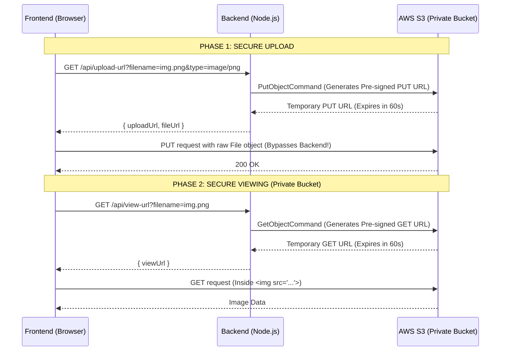

```markdown
# System Design: Secure S3 File Uploads using Pre-signed URLs

## Problem Statement
How do you securely upload and serve user-generated content (e.g., profile pictures, documents) in a modern web application without overwhelming your backend servers?

## The "Junior" Approach (Don't do this)
```text
Frontend -> Node.js (reads entire file into memory) -> AWS S3
```
**Why it fails:** If 1,000 users upload a 5MB image simultaneously, your Node.js server has to hold 5GB of data in RAM. It will crash, latency will spike, and bandwidth costs will skyrocket.

---

## The "Senior" Approach: Direct-to-S3 via Pre-signed URLs
```text
Frontend -> Node.js (generates URL) -> Frontend -> AWS S3 (direct upload)
```
We keep the S3 bucket **private** and use temporary, secure URLs generated by the backend to offload the heavy lifting directly to AWS.

### Architecture Flow



---

## Technical Implementation Details

### 1. The CORS Trap (Crucial Frontend Gotcha)
Because the browser is making a cross-origin `PUT` request directly to S3, S3 must be explicitly configured to accept requests from your frontend domain. Without this, the browser's preflight `OPTIONS` check will fail.

**S3 CORS Configuration:**
```json
[
  {
    "AllowedHeaders": ["Content-Type"],
    "AllowedMethods": ["PUT", "GET"],
    "AllowedOrigins": ["https://myapp.com"],
    "ExposeHeaders": ["ETag"]
  }
]
```

### 2. Generating the URLs (Node.js AWS SDK v3)
*Always use SDK v3 (`@aws-sdk/client-s3`) for modular, modern code.*

**Upload URL (PUT):**
```javascript
import { S3Client, PutObjectCommand } from "@aws-sdk/client-s3";
import { getSignedUrl } from "@aws-sdk/s3-request-presigner";

const s3Client = new S3Client({ region: "us-east-1" });

const command = new PutObjectCommand({
  Bucket: "my-private-bucket",
  Key: filename,
  ContentType: filetype // MUST match the frontend fetch header
});

const uploadUrl = await getSignedUrl(s3Client, command, { expiresIn: 60 });
```

**Viewing URL (GET for Private Buckets):**
```javascript
import { GetObjectCommand } from "@aws-sdk/client-s3";

const command = new GetObjectCommand({
  Bucket: "my-private-bucket",
  Key: filename
});

const viewUrl = await getSignedUrl(s3Client, command, { expiresIn: 60 });
```

### 3. The Frontend Fetch Call
The browser must use a `PUT` method (not `POST`) and strictly match the `Content-Type`.

```javascript
const response = await fetch(uploadUrl, {
  method: "PUT",
  body: fileObject, // Raw File from <input type="file">
  headers: {
    "Content-Type": fileObject.type 
  }
});
```

---

## Advanced System Design: Handling Large Files

### The Problem: Expiration & Network Drops
If a user uploads a 2GB video, a single `PUT` request might take 15 minutes. 
1. If the Pre-signed URL expires mid-upload, S3 throws a `403 Forbidden`.
2. If the user's wifi drops at 99%, the entire 2GB upload restarts from 0%.

### The Solution: S3 Multipart Uploads
For large files, we do not use a single Pre-signed URL. We chunk the file.

1. **Initiate:** Backend calls `CreateMultipartUpload` to get an `UploadId`.
2. **Chunk:** Backend calculates chunk sizes (e.g., 50MB) and generates a **separate Pre-signed PUT URL for each chunk**.
3. **Parallel Upload:** Frontend uses the `File.slice()` API to split the file and uploads chunks in parallel.
4. **Resilience:** If chunk #14 fails, the frontend only retries chunk #14.
5. **Complete:** Backend calls `CompleteMultipartUpload`, and S3 stitches the chunks together.

**Note:** In production, use battle-tested libraries like **Uppy** or **tus-js-client** on the frontend to handle chunking and retry logic rather than building it from scratch.

---

## Production Scaling: Adding a CDN
Pre-signed GET URLs pointing directly to S3 work locally, but in production, S3 bucket regions cause latency for global users. 

**Production Architecture:**
```text
User -> CloudFront (CDN) -> S3 (Private Bucket via Origin Access Control)
```
*   S3 bucket remains strictly private.
*   CloudFront is configured using **OAC (Origin Access Control)** so only the CDN can read from S3.
*   Backend generates Pre-signed URLs (or Signed Cookies) for CloudFront, not S3 directly.
*   User downloads the image from an edge location near them (e.g., Mumbai) instead of the S3 bucket region (e.g., us-east-1).

---

## Mock Interview Q&A

**Q: Why not just make the S3 bucket public?**
**A:** Security and access control. A public bucket allows URL enumeration. Anyone could guess or scrape image URLs. By keeping it private and using Pre-signed GET URLs, the links expire in seconds. Even if a user copies the URL and shares it, it dies quickly. It also allows the backend to inject logic (e.g., "Only generate this GET URL if the requesting user is friends with the profile owner").

**Q: What happens if the Pre-signed URL expires while a large file is still uploading?**
**A:** S3 terminates the connection with a `403 Forbidden`. For small files, we just increase the `expiresIn` time. For massive files (videos), we switch from a single PUT to S3 Multipart Uploads, chunking the file and giving each chunk its own Pre-signed URL. This also allows us to retry individual failed chunks without restarting the whole upload.

**Q: Why did you get a CORS error when testing this?**
**A:** Browsers block cross-origin requests by default. Because my frontend (`localhost:5500`) was sending a `PUT` request directly to S3 (`localhost:4566`), the browser sent a preflight `OPTIONS` request first. S3 rejected it because I hadn't explicitly told the S3 bucket to accept `PUT` requests from my frontend's origin via an S3 CORS policy.

